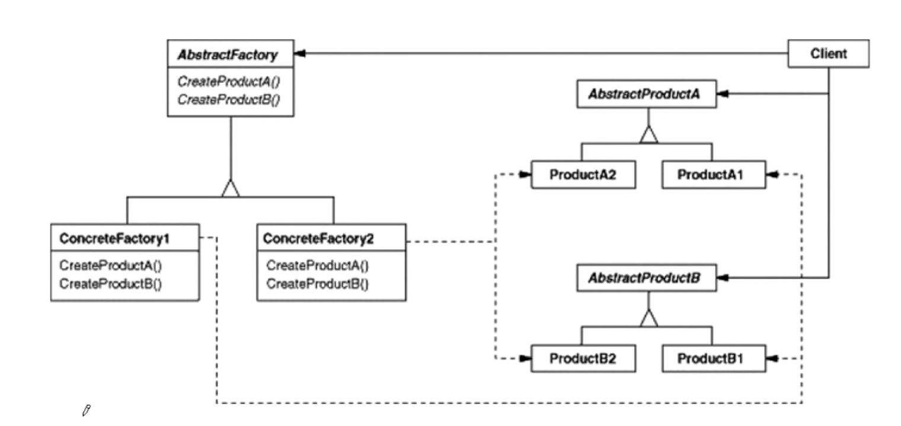

# 抽象工厂模式

#### 动机
* 在软件系统中，经常面临着“一系列相互依赖的对象”的创建工作；同时，由于需求的变化，往往存在更多系列对象的创建工作。
* 如何应对这种变化？如何绕过常规的对象创建方法（new），提供种“封裝机制“来避免客户程序和这种多系列具体对象创建工作“的紧耦合？

#### 模式定义
* 提供一个接口，让该接口负责创建一系列“相关或者相互依赖的对象”，无需指定它们具体的类。

#### 结构图
* 

#### 要点总结
* 如果没有应对多系列对象构建”的需求变化，则没有必要使用abstract Factory/模式,这时候使用简单的工厂完全可以。
* 系列对象”指的是在某一特定系列下的对象之间有相互依赖、或作用的关系。不同系列的对象之间不能相互依赖。
* Abstract Factory 模式主要在于应对“新系列的需求变动。其缺点在于难以应对“新对象”的需求变动。
* 模式稳定的部分就是缺点

#### cpp_demo
```C++
#include <iostream>

class Article {
 public:
  virtual void produce() = 0;
};

class Video {
 public:
  virtual void produce() = 0;
};

class CourseFactory {
 public:
  virtual Video* getVideo() = 0;
  virtual Article* getArticle()= 0;
};

class JavaArticle : public Article {
 public:
  void produce() {
    std::cout << " JavaArticl produce" << std::endl;
  }
};

class JavaVideo : public Video {
 public:
  void produce() {
    std::cout << " JavaVideo produce" << std::endl;
  }
};
class JavaCourseFactory : public CourseFactory {
 public:
  Video* getVideo() {
    return new JavaVideo();
  }
  Article* getArticle() {
    return new JavaArticle();
  }
};

class PythonArticle : public Article {
 public:
  void produce() {
    std::cout << " PythonArticl produce" << std::endl;
  }
};

class PythonVideo : public Video {
 public:
  void produce() {
    std::cout << " PythonVideo produce" << std::endl;
  }
};

class PythonCourseFactory : public CourseFactory {
 public:
  Video* getVideo() {
    return new PythonVideo();
  }
  Article* getArticle() {
    return new PythonArticle();
  }
};
int main() {
  CourseFactory* f1 = new JavaCourseFactory();
  Video* v1 = f1->getVideo();
  Article* a1 = f1->getArticle();
  v1->produce();
  a1->produce();

  CourseFactory* f2 = new PythonCourseFactory();
  Video* v2 = f2->getVideo();
  Article* a2 = f2->getArticle();
  v2->produce();
  a2->produce();
}
```

#### golang_demo
```go
package abstractfactory

import "fmt"

type Article interface {
        produce()
}

type Video interface {
        produce()
}

type CourseFactory interface {
        getVideo() Video
        getArticle() Article
}

type JavaArticle struct{}

func (j *JavaArticle) produce() {
        fmt.Println("JavaArticle produce")
}

type JavaVideo struct{}

func (j *JavaVideo) produce() {
        fmt.Println("JavaVideo produce")
}

type JavaCourseFactory struct{}

func (jc *JavaCourseFactory) getVideo() Video {
        return &JavaVideo{}
}

func (jc *JavaCourseFactory) getArticle() Article {
        return &JavaArticle{}
}
type PythonArticle struct{}

func (p *PythonArticle) produce() {
        fmt.Println("PythonArticle produce")
}

type PythonVideo struct{}

func (p *PythonVideo) produce() {
        fmt.Println("PythonVideo produce")
}

type PythonCourseFactory struct{}

func (py *PythonCourseFactory) getVideo() Video {
        return &PythonVideo{}
}

func (py *PythonCourseFactory) getArticle() Article {
        return &PythonArticle{}
}
import "testing"

func getArticleAndVideo(factory CourseFactory) {
        factory.getArticle().produce()
        factory.getVideo().produce()
}

func TestABSFactory(t *testing.T) {
        var f1 CourseFactory = &JavaCourseFactory{}
        getArticleAndVideo(f1)
        var f2 CourseFactory = &PythonCourseFactory{}
        getArticleAndVideo(f2)
}
```