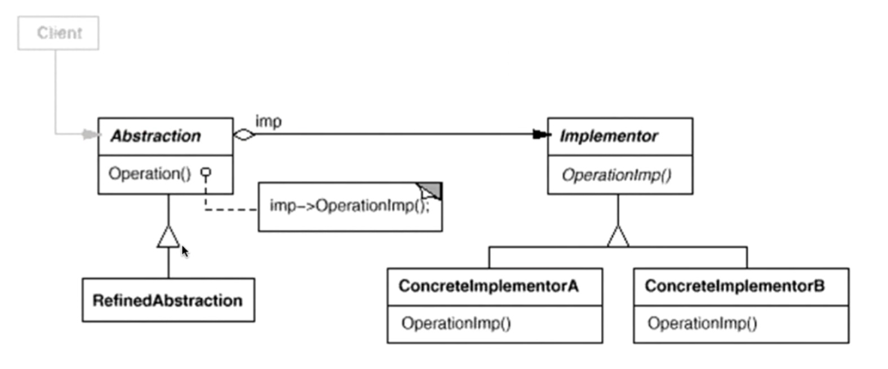

# 桥模式

#### 单一职责模式
* 在软件组件的设计中，如果责任划分的不清晰，使用继承得到的结果往往是随着需求的变化，子类急剧膨胀，同时充斥着重复代码，这时侯的关键是划清责任

#### 动机
* 只override了一部分
* 抽象部分（业务功能）与实现部分（平台实现）分离，使它们可以独立地变化。
* 由于某些类型的固有的实现逻辑，使得它们具有两个变化的维度乃至多个纬度的变化
* 如何应对这种“多维度的变化“？如何利用面向对象技术来使得类型
* 可以轻松地沿着两个乃至多个方向变化，而不引入额外的复杂度？

#### 结构
* 

#### 要点总结
* Bridge 模式使用“对象间的组合关系”解耦了抽象和实现之间固有的绑定关系，使得抽象和实现可以沿着各自的维度来变化。所谓抽象和实现沿着各自纬度的变化，即“子类化“它们。
* Bridge 模式有时候类似于多继承方案，但是多继承方案往往违背单职责原则（即一个类只有一个变化的原因），复用性比较差。Bridge 模式是比多继承方案更好的解决方法
* Bridge 模式的应用一般在“两个非常强的变化维度”，有时一个类也有多于两个的变化维度，这时可以使用 Bridge 的扩展模式。

#### cpp_demo
```c++
class ISwitch
{
 public:
  ISwitch(IElectricalEquipment *ee) { m_pEe = ee; }
  virtual ~ISwitch() {}

  virtual void On() = 0;

  virtual void Off() = 0;

 protected:
  IElectricalEquipment *m_pEe;
};

class IElectricalEquipment
{
 public:
  virtual ~IElectricalEquipment() {}

  virtual void PowerOn() = 0;

  virtual void PowerOff() = 0;
};
class Light : public IElectricalEquipment
{
 public:
  // 开灯
  virtual void PowerOn() override {
    std::cout << "Light is on." << std::endl;
  }

  // 关灯
  virtual void PowerOff() override {
    std::cout << "Light is off." << std::endl;
  }
};

// 风扇
class Fan : public IElectricalEquipment
{
 public:
  // 打开风扇
  virtual void PowerOn() override {
    std::cout << "Fan is on." << std::endl;
  }

  // 关闭风扇
  virtual void PowerOff() override {
    std::cout << "Fan is off." << std::endl;
  }
};
// 拉链式开关
class PullChainSwitch : public ISwitch
{
public:
    PullChainSwitch(IElectricalEquipment *ee) : ISwitch(ee) {}

    // 用拉链式开关打开电器
    virtual void On() override {
        std::cout << "Switch on the equipment with a pull chain switch." << std::endl;
        m_pEe->PowerOn();
    }

    // 用拉链式开关关闭电器
    virtual void Off() override {
        std::cout << "Switch off the equipment with a pull chain switch." << std::endl;
        m_pEe->PowerOff();
    }
};
// 两位开关
class TwoPositionSwitch : public ISwitch
{
 public:
  TwoPositionSwitch(IElectricalEquipment *ee) : ISwitch(ee) {}

  // 用两位开关打开电器
  virtual void On() override {
    std::cout << "Switch on the equipment with a two-position switch." << std::endl;
    m_pEe->PowerOn();
  }

  // 用两位开关关闭电器
  virtual void Off() override {
    std::cout << "Switch off the equipment with a two-position switch." << std::endl;
    m_pEe->PowerOff();
  }
};
int main()
{
    // 创建电器 - 电灯、风扇
    IElectricalEquipment *light = new Light();
    IElectricalEquipment *fan = new Fan();

    /**
    * 创建开关 - 拉链式开关、两位开关
    * 将拉链式开关和电灯关联起来，将两位开关和风扇关联起来
    **/
    ISwitch *pullChain = new PullChainSwitch(light);
    ISwitch *twoPosition = new TwoPositionSwitch(fan);

    // 开灯、关灯
    pullChain->On();
    pullChain->Off();

    // 打开风扇、关闭风扇
    twoPosition->On();
    twoPosition->Off();
}
```

#### golang_demo
```go
package bridge

import "fmt"

type AbstractMessage interface {
	SendMessage(text, to string)
}

type MessageImplementer interface {
	Send(text, to string)
}

type MessageSMS struct{}

func ViaSMS() MessageImplementer {
	return &MessageSMS{}
}

func (*MessageSMS) Send(text, to string) {
	fmt.Printf("send %s to %s via SMS", text, to)
}

type MessageEmail struct{}

func ViaEmail() MessageImplementer {
	return &MessageEmail{}
}

func (*MessageEmail) Send(text, to string) {
	fmt.Printf("send %s to %s via Email", text, to)
}

type CommonMessage struct {
	method MessageImplementer
}

func NewCommonMessage(method MessageImplementer) *CommonMessage {
	return &CommonMessage{
		method: method,
	}
}

func (m *CommonMessage) SendMessage(text, to string) {
	m.method.Send(text, to)
}

type UrgencyMessage struct {
	method MessageImplementer
}

func NewUrgencyMessage(method MessageImplementer) *UrgencyMessage {
	return &UrgencyMessage{
		method: method,
	}
}

func (m *UrgencyMessage) SendMessage(text, to string) {
	m.method.Send(fmt.Sprintf("[Urgency] %s", text), to)
}
```