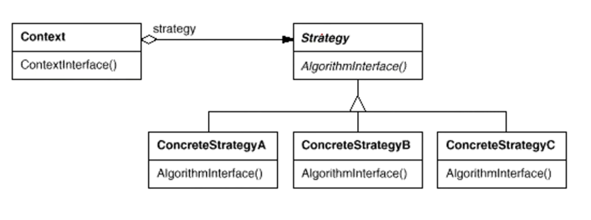

# 策略模式
##### 策略模式
```C++
//抽象接口
class ReplaceAlgorithm
{
 public:
  virtual void Replace() = 0;
};

//三种具体的替换算法
class LRU_ReplaceAlgorithm : public ReplaceAlgorithm
{
 public:
  void Replace() { cout<<"Least Recently Used replace algorithm"<<endl; }
};

class FIFO_ReplaceAlgorithm : public ReplaceAlgorithm
{
 public:
  void Replace() { cout<<"First in First out replace algorithm"<<endl; }
};
class Random_ReplaceAlgorithm: public ReplaceAlgorithm
{
 public:
  void Replace() { cout<<"Random replace algorithm"<<endl; }
};

class Context
{
 public:
    Context(ReplaceAlgorithm *strategy) { m_pStrategy = strategy; }
    void Replace() { m_pStrategy->Replace(); }

 private:
    ReplaceAlgorithm *m_pStrategy;
};
int main() {
  ReplaceAlgorithm* algo1 = new LRU_ReplaceAlgorithm();
  Context* ctx1 = new Context(algo1);
  ctx1->Replace();
  ReplaceAlgorithm* algo2 = new FIFO_ReplaceAlgorithm();
  Context* ctx2 = new Context(algo2);
  ctx2->Replace();
  ReplaceAlgorithm* algo3 = new Random_ReplaceAlgorithm();
  Context* ctx3 = new Context(algo3);
  ctx3->Replace();
}
```

##### 模式定义
* 定义一系列算法，把它们一个个封装起来，并且使它们可互相替換（变化）。该模式使得算法可独立于使用它的客户程序（稳定）而变化（扩展，子类化）。《设计模式》GoF

##### 结构
* 

##### 要点总结
要点总结
* Strategy。及其子类为组件提供了一系列可重用的算法，从而可以使得类型在运行时方便地根据需要在各个算法之间进行切換。
* Strategy 模式提供了用条件判断语句以外的另一种选择，消除条件判断语，就是在解耦合。含有许多条件判断语句的代码通常都需要 Strategy 模式。
* if else 出现的条件后，就是策略模式出现的机会，如果if else 条件保持绝对不变的情况下，不适用策略模式
* 如果 Strategyy 对象没有实例变量，那么各个上下文可以共享同 Strategy 对象，从而节省对象开销

##### 动机
* 代码段最好放在高级缓存
* 代码过长会占用CPU高级缓存的位置
* 适用扩展的算法应对变化

##### golang
```go
package strategy

import "fmt"

type PaymentContext struct {
	Name, CardID string
	Money        int
	payment      PaymentStrategy
}

func NewPaymentContext(name, cardid string, money int, payment PaymentStrategy) *PaymentContext {
	return &PaymentContext{
		Name:    name,
		CardID:  cardid,
		Money:   money,
		payment: payment,
	}
}

func (p *PaymentContext) Pay() {
	p.payment.Pay(p)
}

type PaymentStrategy interface {
	Pay(*PaymentContext)
}

type Cash struct{}

func (*Cash) Pay(ctx *PaymentContext) {
	fmt.Printf("Pay $%d to %s by cash", ctx.Money, ctx.Name)
}

type Bank struct{}

func (*Bank) Pay(ctx *PaymentContext) {
	fmt.Printf("Pay $%d to %s by bank account %s", ctx.Money, ctx.Name, ctx.CardID)
}
```

#### test
```go
func TestPayByCash(t *testing.T) {
	ctx := NewPaymentContext("Ada", "", 123, &Cash{})
	ctx.Pay()
	// Output:
	// Pay $123 to Ada by cash
}

func TestPayByBank(t *testing.T) {
	ctx := NewPaymentContext("Bob", "0002", 888, &Bank{})
	ctx.Pay()
	// Output:
	// Pay $888 to Bob by bank account 0002
}
```