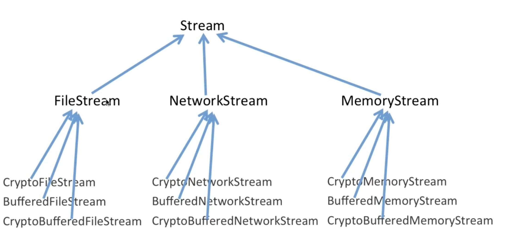
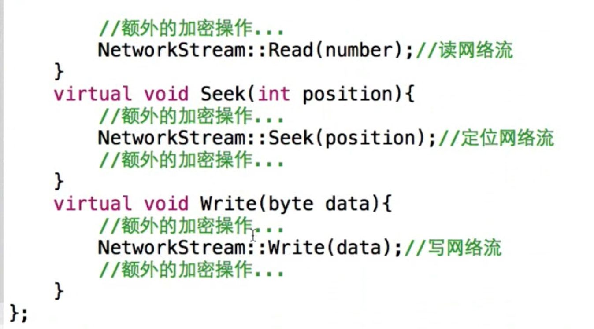
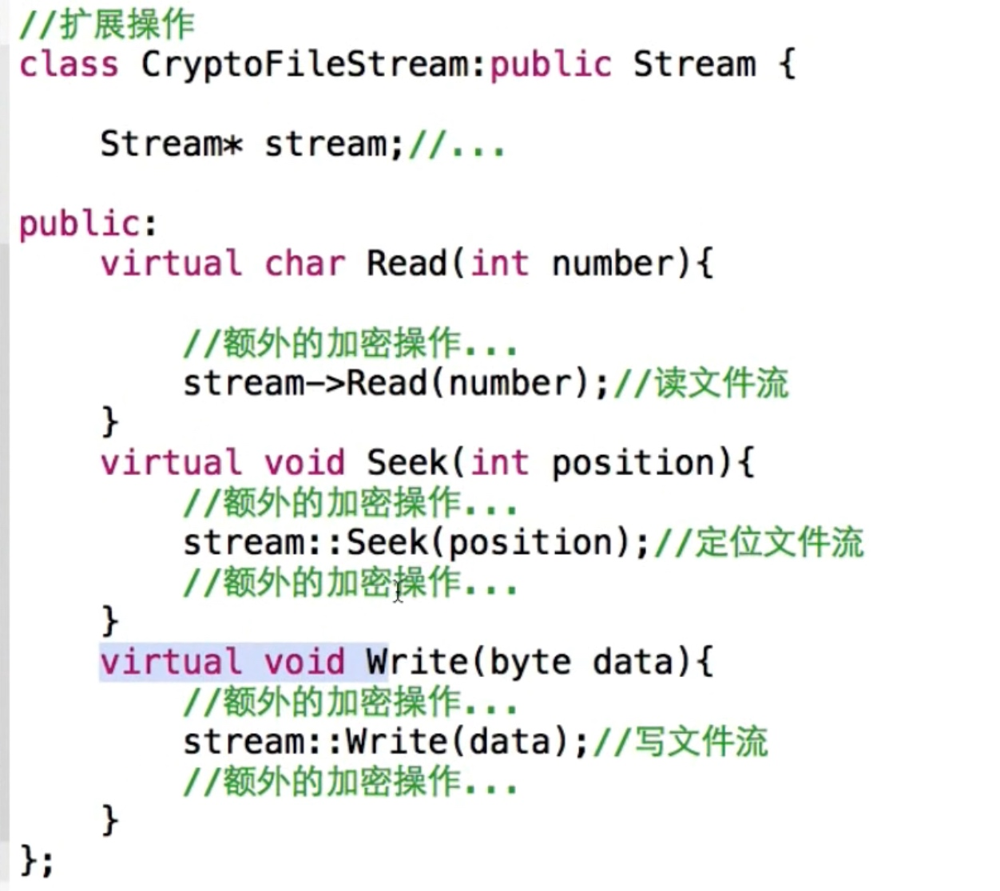
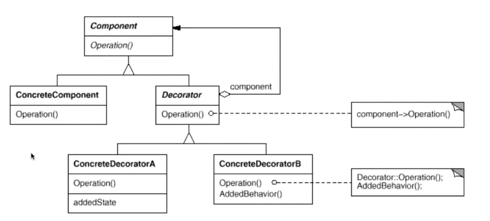
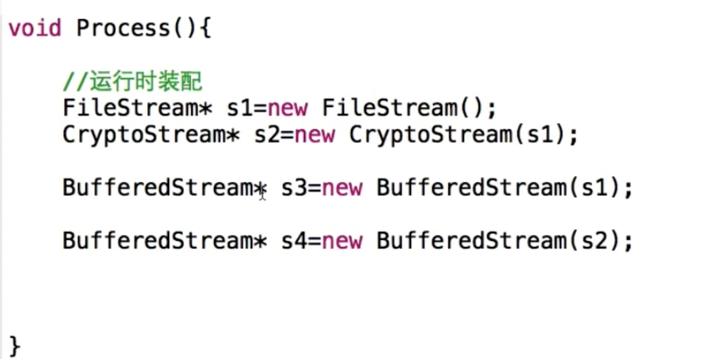
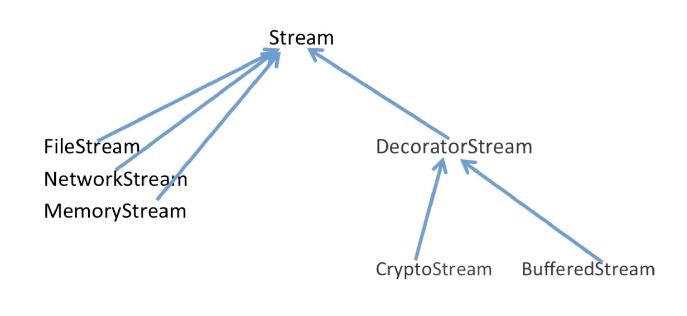
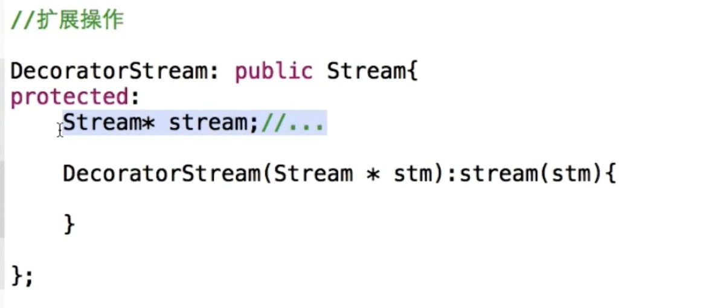

# 装饰模式

#### 单一指责模式
* 在软件组件的设计中，如果责任划分的不清晰，使用继承得到的结果往往是随着需求的变化，子类急剧膨胀，同时充斥着重复代码，这时候的关键是划清责任
* 典型模式
* decorator
* bridge

#### 动机
* 在某些情况下我们可能会“过度地使用继承来扩展对象的功能”，由于继承为类型引人的静态特质，使得这种扩展方式缺乏灵活性；并且随着子类的增多（扩展功能的增多），各种子类的组合（扩展功能的组合）会导致更多子类的膨胀
* 如何使“对象功能的扩展“能够根据需要来动态地实现？同时避免“扩展功能的増多”带来的子类膨胀问题？从而使得任何“功能扩展变化“所导致的影响将为最低？

#### demo
* 
* 
* 
* 

#### 结构



#### slide
* 编译时共用
* 运行时多态
* 运行时装配
* 

##### 重构之后


#### 要点总结
* 通过采用组合而非继承的手法，Decorator 模式实现了在运行时动态扩展对象功能的能力，而且可以根据需要扩展多个功能。避免了使用继承带来的“灵活性差”和“多子类衍生问题”。

* Decorator 类在接口上表现为 is- a Componenti 的继承关系，即 Decorator 类继承了 Component 类所具有的接口。但在实现上又表现为 has- a Component 的组合关系，即 Decorator 类又使用了另外个 Component 类。

* Decorator/模式的目的并非解决“多子类衍生的多继承”问题，Decorator 模式应用的要点在于解决“主体类在多个方向上的扩展功能”一是为“装饰”的含义

#### 装饰器的标示
* 
* 同时继承和组合

#### golang-demo
```go
package decorator

type Component interface {
	Calc() int
}

type ConcreteComponent struct{}

func (*ConcreteComponent) Calc() int {
	return 0
}

type MulDecorator struct {
	Component
	num int
}

func WarpMulDecorator(c Component, num int) Component {
	return &MulDecorator{
		Component: c,
		num:       num,
	}
}

func (d *MulDecorator) Calc() int {
	return d.Component.Calc() * d.num
}

type AddDecorator struct {
	Component
	num int
}

func WarpAddDecorator(c Component, num int) Component {
	return &AddDecorator{
		Component: c,
		num:       num,
	}
}

func (d *AddDecorator) Calc() int {
	return d.Component.Calc() + d.num
}

package decorator

import "fmt"

func ExampleDecorator() {
	var c Component = &ConcreteComponent{}
	c = WarpAddDecorator(c, 10)
	c = WarpMulDecorator(c, 8)
	res := c.Calc()

	fmt.Printf("res %d\n", res)
	// Output:
	// res 80
}
```

#### cpp_demo
```c++
#include <iostream>

class Machine
{
 public:
  std::string _name;
 public:
  Machine(std::string tmp) :_name(tmp){}
  Machine(){}
  virtual void show() = 0;
};

class AirCondition:public Machine
{
 public:
  AirCondition(std::string name):Machine(name){}
  AirCondition(){}
  virtual void show()
  {
    std::cout<<"machine name is " << _name << std::endl;
  }
};

class Television:public Machine
{
 public:
  Television(std::string name):Machine(name){}
  Television(){}
  virtual void show()
  {
    std::cout<<"machine name is " << _name << std::endl;
  }
};
class Decorator:public Machine
{
 protected:
  Machine* _person;   //要进行装饰的类
 public:
  Decorator(Machine* tmp)
  {
    _person = tmp;
  }

  virtual void show()
  {
    _person->show();
  }
};

class AirDecorator :public Decorator
{
 public:
  AirDecorator(Machine *tmp):Decorator(tmp){}
  virtual void show()
  {
    this->ExternalFunction();
    Decorator::show();
  }

  void ExternalFunction() //额外功能
  {
    std::cout << "AirDecorator ExternalFunction " << std::endl;
  }
};
class TeleDecorator :public Decorator
{
 public:
  TeleDecorator(Machine *tmp):Decorator(tmp){}
  virtual void show()
  {
    this->ExternalFunction();
    Decorator::show();
  }

  void ExternalFunction() //额外功能
  {
    std::cout << "TeleDecorator ExternalFunction " << std::endl;
  }
};

int main()
{
  Machine *air = new AirCondition("air");
  Decorator * dec1 = new AirDecorator(air);

  dec1->show();

  Machine *tele = new Television("tele");
  Decorator * dec2 = new TeleDecorator(tele);

  dec2->show();
}
```
