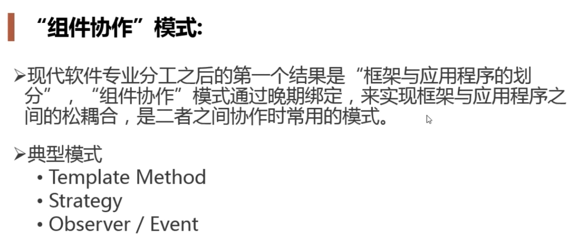
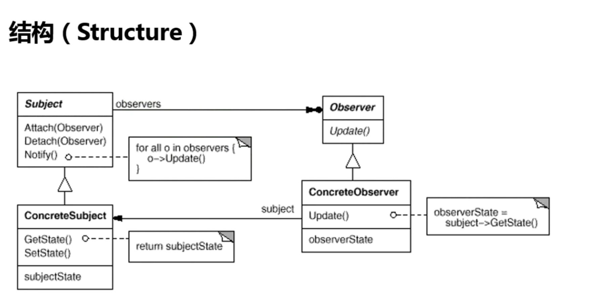

# 观察者模式

#### 组件协作模式
* 

#### 多重继承
* 一个是主的继承类
* 其他都是抽象的接口

#### 模式定义
* 定义对象间的一种一对多（变化）的依赖关系，以便当一个对象（Subject）的状态发生改变时，所有依赖于它的对象都得到通知并自动更新。

#### 结构
* 
* Subject和Object是稳定的
* ConcreteSubject和ConcreteObserver

#### 要点总结
* 使用面向对象的抽象，Observer 模式使得我们可以独立地改变目标与观察者，从而使二者之间的依赖关系达致松耦合。

* 目标发送通知时，无需指定观察者，通知（可以携带通知信息作

* 为参数）会自动传播。

* 观察者自己決定是否需要订阋通知，目标对象对此无所知。Observers 模式是基于事件的 UI 框架中非常常用的设计模式，也是

* MVC 模式的一个重要组成部分。

#### code
```go
package observer

import "fmt"

type Subject struct {
	observers []Observer
	context   string
}

func NewSubject() *Subject {
	return &Subject{
		observers: make([]Observer, 0),
	}
}

func (s *Subject) Attach(o Observer) {
	s.observers = append(s.observers, o)
}

func (s *Subject) notify() {
	for _, o := range s.observers {
		o.Update(s)
	}
}

func (s *Subject) UpdateContext(context string) {
	s.context = context
	s.notify()
}

type Observer interface {
	Update(*Subject)
}

type Reader struct {
	name string
}

func NewReader(name string) *Reader {
	return &Reader{
		name: name,
	}
}

func (r *Reader) Update(s *Subject) {
	fmt.Printf("%s receive %s\n", r.name, s.context)
}

package observer

func ExampleObserver() {
	subject := NewSubject()
	reader1 := NewReader("reader1")
	reader2 := NewReader("reader2")
	reader3 := NewReader("reader3")
	subject.Attach(reader1)
	subject.Attach(reader2)
	subject.Attach(reader3)

	subject.UpdateContext("observer mode")
	// Output:
	// reader1 receive observer mode
	// reader2 receive observer mode
	// reader3 receive observer mode
}
```