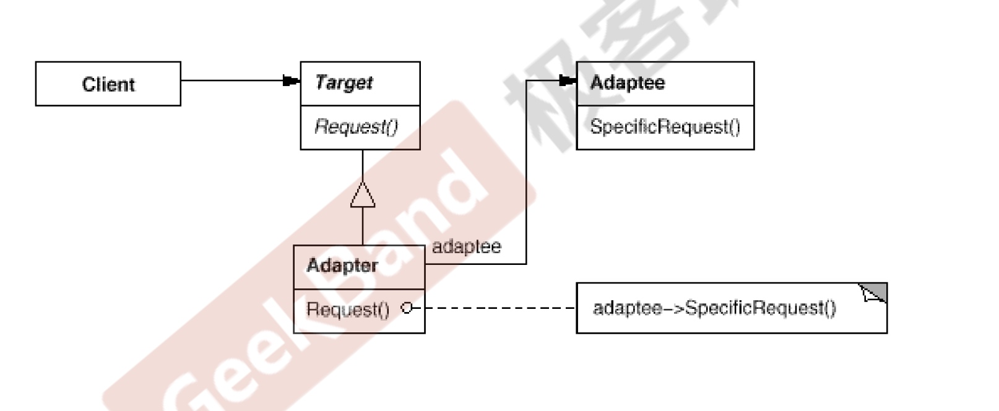

# 适配器模式

#### 动机
* 在软件系统中，由于应用环境的变化，常常需要将““一些现存的对象”放在新的环境中应用，但是新环境要求的接口是这些现存对象所不满足的

* 如何应对这种“迁移的变化“？如何既能利用现有对象的良好实现，同时又能满足新的应用环境所要求的接口？

#### 结构


#### 要点总结
* Adapters 模式主要应用于“希望复用一些现存的类，但是接口又与
* 复用环境要求不一致的情況”，在遗留代码复用、类库注移等方面非常有用。
* GoF23 采用了两种 Adapter 模式的实现结构：对象和适配器。但类适配器采用“多继承”的实现方式般不推荐使用。对象适配器采用“对象组合“的方式，更符合松耦合精神。
* Adapter 模式可以实现的非常灵活，不必拘泥于 Gof23 中定义的两种结构。例如，完全可以将 Adapter 模式中现存对象”作为新的接口方法参数，来达到适配的目的。
* 对象适配器比类适配器好

#### Cpp_demo
```C++
class IRussiaSocket {
public:
    virtual void Charge() = 0;
};

class OwnCharger {
public:
    void ChargeWithFeetFlat() {
        std::cout << "OwnCharger::chargeWithFeetFlat" << std::endl;
    }
};

class PowerAdapter : public IRussiaSocket {
private:
    OwnCharger *m_pCharger;
public:
    PowerAdapter() : m_pCharger(new OwnCharger()) {}
    ~PowerAdapter() {}

    void Charge() {
        m_pCharger->ChargeWithFeetFlat();
    }
};

int main() {
    IRussiaSocket* p = new PowerAdapter();
    p->Charge();
}
```

#### golang_demo
```go
import "fmt"

type IRussiaSocket interface {
	Charge()
}

type ChinaCharger struct{}

func (c *ChinaCharger) ChargeWithFeetFlat() {
	fmt.Println("ChinaCharger ChargeWithFeetFlat")
}

type PowerAdapter struct {
	chinaCharger *ChinaCharger
}

func (p *PowerAdapter) Charge() {
	p.chinaCharger.ChargeWithFeetFlat()
}
import "testing"

func TestAdapter1(t *testing.T) {
	chinaCharger := &ChinaCharger{}
	pAdapter := &PowerAdapter{chinaCharger: chinaCharger}
	pAdapter.Charge()
}
```