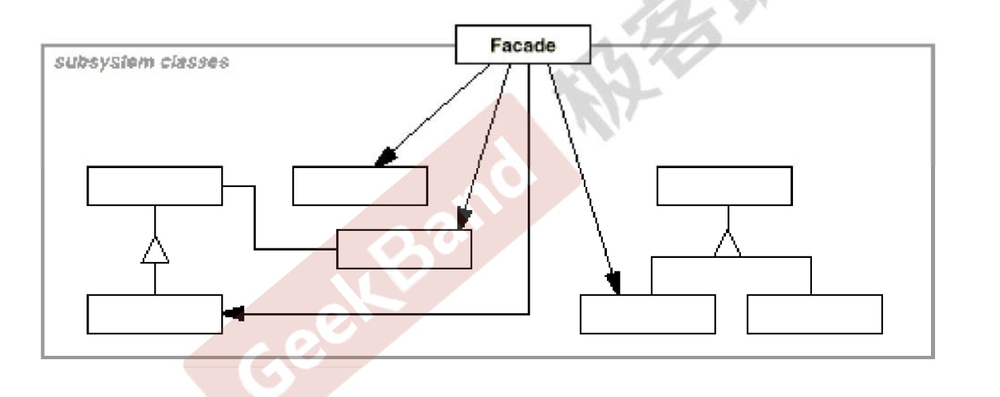

# 门面模式

#### 接口隔离模式
* 在组件构建过程中，某些接口之间直接的依赖常常会带来很多题、甚至根本无法实现。采用添加一层间接（稳定）接口，来隔离本来互相紧密关联的接口是一种常见的解決方案。

#### 系统间耦合的复杂度
* 方案的问题在于组件的客户和组件中各种复杂的子系统有了过多的耦合，随着外部客户程序和各子系统的演化，这种过多的耦合面临很多变化的挑战。

#### 结构
* 


#### 要点总结
* 从客户程序的角度来看，Facade 模式简化了整个组件系统的接口对于组件内部与外部客户程序来说达到了种“解耦”果内部学系统的程何雯化不会影到 Facades 接口的变
* Facade 设计模式更注重从架构的层次去看整个系统，而不是单个类的层次。Facade 很多时候更是一种架构
* Facade 设计模式并非、个集装箱，可以任意地放进任何多个对象。Facade 模式中组件的内部应该是、相互合关比较大的一系列组件”，而不是简单的功能集合

#### cpp_demo
```C++
//
// Created by 刘超 on 2019-11-14.
//
#include <iostream>

class SubSystem1 {
public:
    SubSystem1() {}
    ~SubSystem1() {}

    void Operation() {std::cout << "Subsystem1 operation..." << std::endl;}
};

class SubSystem2 {
public:
    SubSystem2() {}
    ~SubSystem2() {}
    void Operation() {std::cout << "Subsystem2 operation..." << std::endl;}
};

class Facade {
public:
    Facade() {
        sub1 = new SubSystem1();
        sub2 = new SubSystem2();
    }

    ~Facade();
    void OperatonWrapper() {
        sub1->Operation();
        sub2->Operation();
    }
    SubSystem1* sub1;
    SubSystem2* sub2;
};

int main() {
    Facade* f =  new Facade();
    f->OperatonWrapper();
}
```

#### go_demo
```go
package design_pattern

import "fmt"

type PointsGift struct {
	name string
}

func (p *PointsGift) getName() string {
	return p.name
}

type QualifyService struct {
}

func (q *QualifyService) isAvailable(pointGift *PointsGift) bool {
	fmt.Println("check" + pointGift.getName() + " pass")
	return true
}

type PointPaymentService struct {
}

func (p *PointPaymentService) pay(pointsGift *PointsGift) bool {
	fmt.Println("pay " + pointsGift.getName() + " success")
	return true
}

type ShippingService struct {
}

func (s *ShippingService) shipGift(pointsGift *PointsGift) string {
	fmt.Println("access wuliu" + pointsGift.getName())
	return "6666"
}

type GiftExChangeService struct {
	qualitySvr  *QualifyService
	pointPaySvr *PointPaymentService
	shippingSvr *ShippingService
}

func (g *GiftExChangeService) giftExchange(pointsGift *PointsGift) {
	if g.qualitySvr.isAvailable(pointsGift) && g.pointPaySvr.pay(pointsGift) {
		orderNo := g.shippingSvr.shipGift(pointsGift)
		fmt.Println("Order transfer success no " + orderNo)
	}
}
func TestFacade(t *testing.T) {
	pointGift := &PointsGift{name: "T xue"}
	giftExchangeSvr := &GiftExChangeService{}
	giftExchangeSvr.giftExchange(pointGift)
}

```