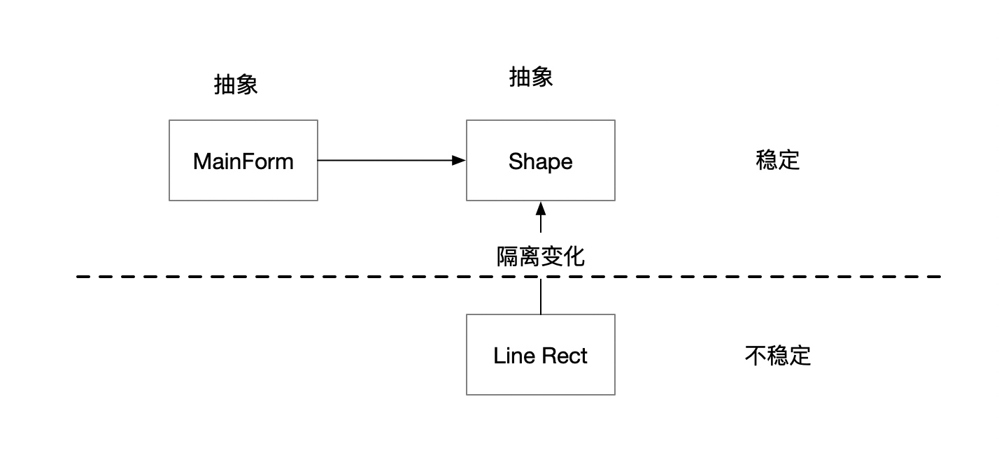

# 面向对象设计原则

#### 面向对象设计
* 变化是复用的
* 抵御变化

#### 认知
* 从语言实现层面来看，对象封装了代码和数据。
* 从规格层面讲，对象是一系列可被使用的公共接口
* 从概念层面讲，对象是某种拥有责任的抽象。

#### 设计原则

##### 依赖倒置原则（DIP)
* 高层模块（稳定不应该依赖于低层模块（变化） 二者都依赖于抽象（稳定）
* 抽象不应该依赖于实现细节，实现细节应该依赖于抽象
* 

##### 开放封闭原则
* 对扩展开放，对更改封闭。
* 类模块应该是可扩展的，但是不可修改。

##### 单一职责原则（SRP)
* 一个类应该仅有一个引起它变化的原因
* 变化的方向隐含着类的责任。

##### Liskov 替换原则（LSP)
* 子类必须能够替換它们的基类（IS-A）。继承表达类型抽象。

#### 接口隔离原则（ISP)
・不应该强迫客户程序依赖它们不用的方法。・接口应该小而完备

##### 优先使用组合
* 继承破坏了封装性，子类父类耦合高

##### 封装变化点

##### 针对接口编程
* 针对接口编程，而不是针对实现编程
* 不将变量类型声明为某个特定的具体类，而是声明为某个接口。
* 客户程序无需获知对象的具体类型，只需要知道对象所具有的接口。
* 減少系统中各部分的依赖关系，从而实现“高内聚、松耦合的类型设计方案。