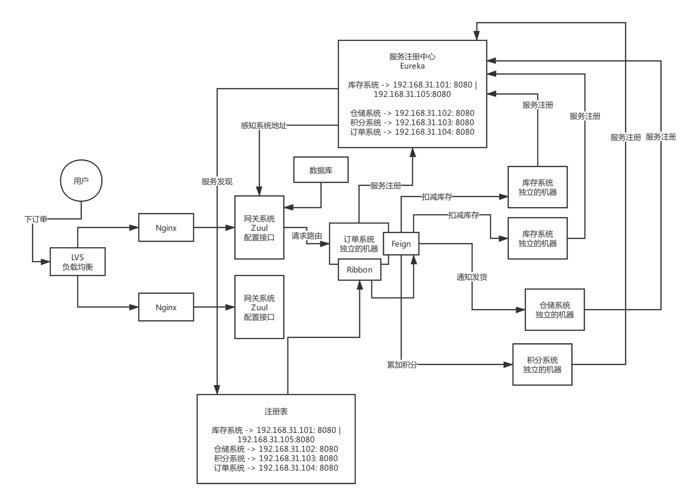

# API网关

#### 功能
* (1)动态路由：新开发某个服务，动态把请求路径和服务的映射关系热加载到网关里去；服务增减机器，网关自动热感知
* (2)灰度发布
* (3)授权认证
* (4)性能监控：每个API接口的耗时、成功率、QPS
* (5)系统日志
* (6)数据缓存
* (7)限流熔断

#### 动态路由
* 更新配置写数据库
* 网关定期去拉取新的配置

#### 每秒10万高并发访问
* 
* Zuul网关部署的是什么配置的机器，部署32核64G，对网关路由转发的请求，每秒抗个小几万请求是不成问题的，几台Zuul网关机器
* 每秒是1万请求，8核16G的机器部署Zuul网关，5台机器就够了

#### 核心功能
* 动态路由
* 灰度发布
* 授权认证
* 限流熔断

#### 服务从开发到上线，服务注册、网关路由、服务调用的流程！
* 生产环境，微服务生产实践
* 开发了一个新的服务，线上部署，配合网关动态路由的功能，在网关里配置一下路径和新服务的映射关系，此时请求过来直接就可以走到新的服务里去
* 对已有服务进行迭代和开发，新版本，灰度发布，新版本部署少数几台机器，通过一个界面，开启这个服务的灰度发布，此时zuul filter启用，按照你的规则，把少量的流量打入到新版本部署的机器上去
* 观察一下少量流量在新版本的机器上运行是否正常
* 版本改成current，全量机器部署，关闭灰度发布功能，网关就会把流量均匀分发给那个服务了

#### 上万并发考虑因素
* 服务框架的技术选型
* 服务注册中心技术选型和核心原理
* 生产优化
* 架构优化
* 网关系统技术选型和核心原理
* 生产优化（灰度发布、动态路由）
* 生产级的分布式系统里，新服务开发如何做，老服务迭代如何做

#### 并发3000
* 中小型的系统，拆分为10~20个服务，微服务，庞大的互联网公司，都有几百个、几千个、几万个服务，服务规模，服务注册中心，妥妥的，2~3台机器就足够了，把服务的上线、故障以及发现优化到极致

服务上线，注册表多级缓存同步1秒，注册表拉取频率降低为1秒 服务心跳，1秒上报1次 故障发现，1秒钟检查一次1心跳，如果发现2秒内服务没上报心跳，认为故障了

服务注册中心都没任何压力，最多就是每秒钟几十次请求而已

服务注册中部署个2台机器，每台机器就是4核8G，高可用冗余，任何一台机器死掉，不会影响系统的运行

服务注册中心这样的一个处理逻辑，4核8G的机器，每秒钟轻松抗几百请求，上千请求也是可以的

通常来说，如果每秒钟的并发在1000以内的话，很少部署的，每个服务部署2台机器，每台机器4核8G，每台机器每秒抗个几百请求，一点问题都没有，别搞出来一个请求过来，查数据库SQL写的太烂了，一条SQL要跑3秒钟

大部分的系统，高峰期每秒几百请求，低峰期每秒几十请求，甚至几个请求

网关系统，4核8G的机器，一台机器抗每秒几百请求，部署3~4台机器，保证可以网关系统每台机器的压力比较小，进一步保证网关系统可靠性

数据库，MySQL，16核32G，物理机最佳，32核64G，最多抗个每秒钟几千请求问题不大，平时抗个每秒钟几十或者几百请求，三四千请求，但是只不过此时会导致MySQL机器的负载很高，CPU使用率很高，磁盘IO负载很高，网络负载很高