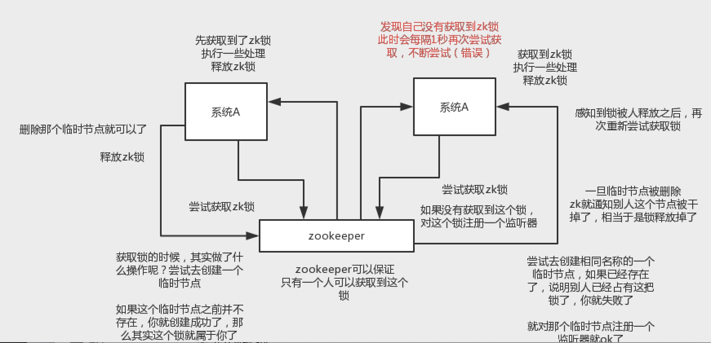
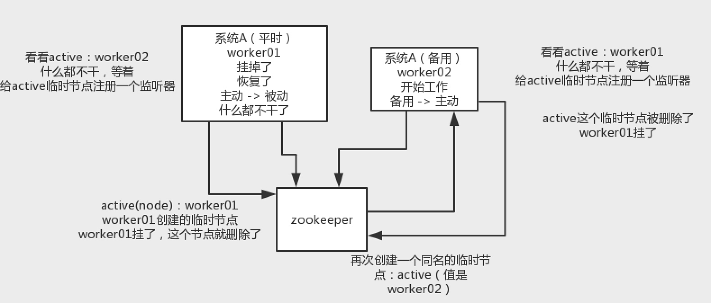

# zk使用场景

* （1）分布式协调：这个其实是zk很经典的一个用法，简单来说，就好比，你A系统发送个请求到mq，然后B消息消费之后处理了。那A系统如何知道B系统的处理结果？用zk就可以实现分布式系统之间的协调工作。A系统发送请求之后可以在zk上对某个节点的值注册个监听器，一旦B系统处理完了就修改zk那个节点的值，A立马就可以收到通知，完美解决。

* （2）分布式锁：对某一个数据连续发出两个修改操作，两台机器同时收到了请求，但是只能一台机器先执行另外一个机器再执行。那么此时就可以使用zk分布式锁，一个机器接收到了请求之后先获取zk上的一把分布式锁，就是可以去创建一个znode，接着执行操作；然后另外一个机器也尝试去创建那个znode，结果发现自己创建不了，因为被别人创建了。。。。那只能等着，等第一个机器执行完了自己再执行。

* （3）元数据/配置信息管理：zk可以用作很多系统的配置信息的管理，比如kafka、storm等等很多分布式系统都会选用zk来做一些元数据、配置信息的管理，包括dubbo注册中心不也支持zk么

* （4）HA高可用性：主节点和从节点，从节点建立临时节点监控主节点，主节点挂了，zk删除临时节点，然后通知watch的从节点

