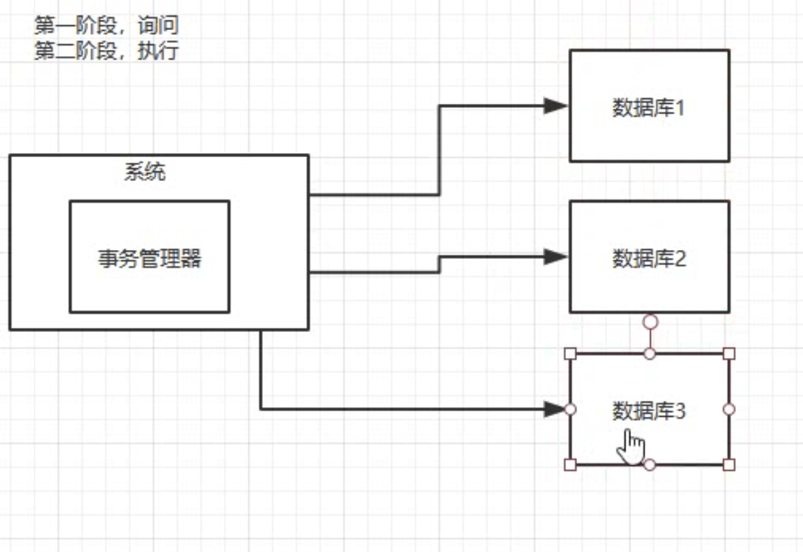
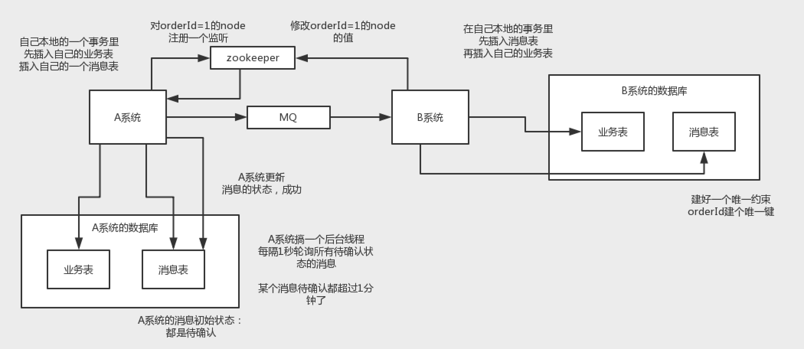
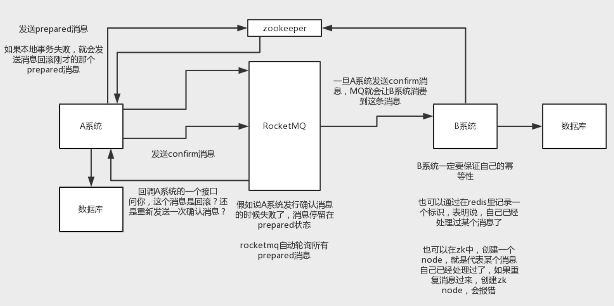

# 分布式事务

#### 两阶段提交

* 比较适合单块应用里，跨多个库的分布式事务，而且因为严重依赖于数据库层面来搞定复杂的事务，效率很低，绝对不适合高并发的场景

#### TCC方案
* TCC的全程是：Try、Confirm、Cancel。这个其实是用到了补偿的概念，分为了三个阶段：
* 1）Try阶段：这个阶段说的是对各个服务的资源做检测以及对资源进行锁定或者预留
* 2）Confirm阶段：这个阶段说的是在各个服务中执行实际的操作
* 3）Cancel阶段：如果任何一个服务的业务方法执行出错，那么这里就需要进行补偿，就是执行已经执行成功的业务逻辑的回滚操作
* 手写回滚和补偿机制

#### 本地消息表

#### 最终一致性方案
* 大概的意思就是：
* 1）A系统先发送一个prepared消息到mq，如果这个prepared消息发送失败那么就直接取消操作别执行了
* 2）如果这个消息发送成功过了，那么接着执行本地事务，如果成功就告诉mq发送确认消息，如果失败就告诉mq回滚消息
* 3）如果发送了确认消息，那么此时B系统会接收到确认消息，然后执行本地的事务
* 4）mq会自动定时轮询所有prepared消息回调你的接口，问你，这个消息是不是本地事务处理失败了，所有没发送确认消息？那是继续重试还是回滚？一般来说这里你就可以查下数据库看之前本地事务是否执行，如果回滚了，那么这里也回滚吧。这个就是避免可能本地事务执行成功了，别确认消息发送失败了。
* 5）这个方案里，要是系统B的事务失败了咋办？重试咯，自动不断重试直到成功，如果实在是不行，要么就是针对重要的资金类业务进行回滚，比如B系统本地回滚后，想办法通知系统A也回滚；或者是发送报警由人工来手工回滚和补偿

#### 最大努力通知方案
* 1）系统A本地事务执行完之后，发送个消息到MQ
* 2）这里会有个专门消费MQ的最大努力通知服务，这个服务会消费MQ然后写入数据库中记录下来，或者是放入个内存队列也可以，接着调用系统B的接口
* 3）要是系统B执行成功就ok了；要是系统B执行失败了，那么最大努力通知服务就定时尝试重新调用系统B，反复N次，最后还是不行就放弃