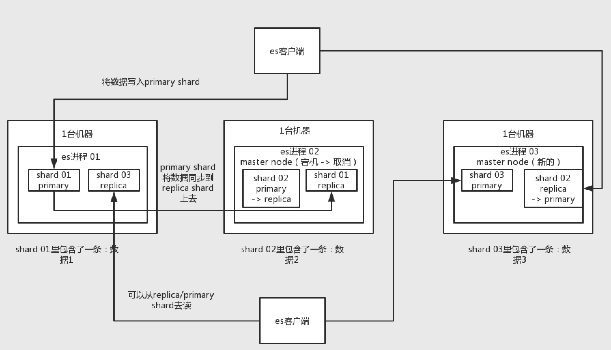
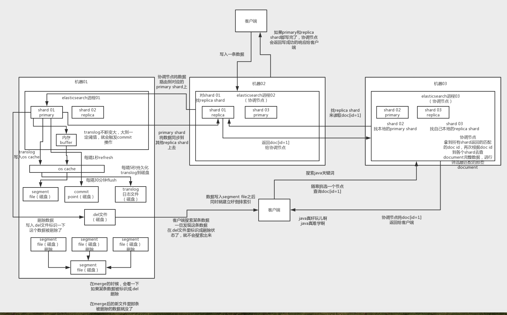

# 分布式搜索引擎

#### 基本问题
* （1）es的分布式架构原理能说一下么（es是如何实现分布式的啊）？

* （2）es写入数据的工作原理是什么啊？es查询数据的工作原理是什么啊？

* （3）es在数据量很大的情况下（数十亿级别）如何提高查询性能啊？

* （4）es生产集群的部署架构是什么？每个索引的数据量大概有多少？每个索引大概有多少个分片？

#### ES原理
* index->type->mapping->document->field
* 一个index里可能就一个type，但是确实如果说是一个index里有多个type的情况，你可以认为index是一个类别的表，具体的每个type代表了具体的一个mysql中的表
* mapping代表表结构
* 一条document就代表了mysql中某个表里的一行给，每个document有多个field，每个field就代表了这个document中的一个字段的值

#### 结构

* 实际上你往index里的一个type里面写的一条数据，叫做一条document，一条document就代表了mysql中某个表里的一行给，每个document有多个field，每个field就代表了这个document中的一个字段的值
* 接着你搞一个索引，这个索引可以拆分成多个shard，每个shard存储部分数据。
* 接着就是这个shard的数据实际是有多个备份，就是说每个shard都有一个primary shard，负责写入数据，但是还有几个replica shard。primary shard写入数据之后，会将数据同步到其他几个replica shard上去。
* 通过这个replica的方案，每个shard的数据都有多个备份，如果某个机器宕机了，没关系啊，还有别的数据副本在别的机器上呢。

#### 写入数据和查询数据工作原理
* 
* 1）先写入buffer，在buffer里的时候数据是搜索不到的；同时将数据写入translog日志文件

* 2）如果buffer快满了，或者到一定时间，就会将buffer数据refresh到一个新的segment file中，但是此时数据不是直接进入segment file的磁盘文件的，而是先进入os cache的。这个过程就是refresh。

* 每隔1秒钟，es将buffer中的数据写入一个新的segment file，每秒钟会产生一个新的磁盘文件，segment file，这个segment file中就存储最近1秒内buffer中写入的数据

* 但是如果buffer里面此时没有数据，那当然不会执行refresh操作咯，每秒创建换一个空的segment file，如果buffer里面有数据，默认1秒钟执行一次refresh操作，刷入一个新的segment file中

只要buffer中的数据被refresh操作，刷入os cache中，就代表这个数据就可以被搜索到了

为什么叫es是准实时的？NRT，near real-time，准实时。默认是每隔1秒refresh一次的，所以es是准实时的，因为写入的数据1秒之后才能被看到。

可以通过es的restful api或者java api，手动执行一次refresh操作，就是手动将buffer中的数据刷入os cache中，让数据立马就可以被搜索到。

只要数据被输入os cache中，buffer就会被清空了，因为不需要保留buffer了，数据在translog里面已经持久化到磁盘去一份了

3）只要数据进入os cache，此时就可以让这个segment file的数据对外提供搜索了

4）重复1~3步骤，新的数据不断进入buffer和translog，不断将buffer数据写入一个又一个新的segment file中去，每次refresh完buffer清空，translog保留。随着这个过程推进，translog会变得越来越大。当translog达到一定长度的时候，就会触发commit操作。

buffer中的数据，倒是好，每隔1秒就被刷到os cache中去，然后这个buffer就被清空了。所以说这个buffer的数据始终是可以保持住不会填满es进程的内存的。

每次一条数据写入buffer，同时会写入一条日志到translog日志文件中去，所以这个translog日志文件是不断变大的，当translog日志文件大到一定程度的时候，就会执行commit操作。

5）commit操作发生第一步，就是将buffer中现有数据refresh到os cache中去，清空buffer

6）将一个commit point写入磁盘文件，里面标识着这个commit point对应的所有segment file

7）强行将os cache中目前所有的数据都fsync到磁盘文件中去

translog日志文件的作用是什么？就是在你执行commit操作之前，数据要么是停留在buffer中，要么是停留在os cache中，无论是buffer还是os cache都是内存，一旦这台机器死了，内存中的数据就全丢了。

所以需要将数据对应的操作写入一个专门的日志文件，translog日志文件中，一旦此时机器宕机，再次重启的时候，es会自动读取translog日志文件中的数据，恢复到内存buffer和os cache中去。

commit操作：1、写commit point；2、将os cache数据fsync强刷到磁盘上去；3、清空translog日志文件

8）将现有的translog清空，然后再次重启启用一个translog，此时commit操作完成。默认每隔30分钟会自动执行一次commit，但是如果translog过大，也会触发commit。整个commit的过程，叫做flush操作。我们可以手动执行flush操作，就是将所有os cache数据刷到磁盘文件中去。

不叫做commit操作，flush操作。es中的flush操作，就对应着commit的全过程。我们也可以通过es api，手动执行flush操作，手动将os cache中的数据fsync强刷到磁盘上去，记录一个commit point，清空translog日志文件。

9）translog其实也是先写入os cache的，默认每隔5秒刷一次到磁盘中去，所以默认情况下，可能有5秒的数据会仅仅停留在buffer或者translog文件的os cache中，如果此时机器挂了，会丢失5秒钟的数据。但是这样性能比较好，最多丢5秒的数据。也可以将translog设置成每次写操作必须是直接fsync到磁盘，但是性能会差很多。

实际上你在这里，如果面试官没有问你es丢数据的问题，你可以在这里给面试官炫一把，你说，其实es第一是准实时的，数据写入1秒后可以搜索到；可能会丢失数据的，你的数据有5秒的数据，停留在buffer、translog os cache、segment file os cache中，有5秒的数据不在磁盘上，此时如果宕机，会导致5秒的数据丢失。

如果你希望一定不能丢失数据的话，你可以设置个参数，官方文档，百度一下。每次写入一条数据，都是写入buffer，同时写入磁盘上的translog，但是这会导致写性能、写入吞吐量会下降一个数量级。本来一秒钟可以写2000条，现在你一秒钟只能写200条，都有可能。

10）如果是删除操作，commit的时候会生成一个.del文件，里面将某个doc标识为deleted状态，那么搜索的时候根据.del文件就知道这个doc被删除了

11）如果是更新操作，就是将原来的doc标识为deleted状态，然后新写入一条数据

12）buffer每次refresh一次，就会产生一个segment file，所以默认情况下是1秒钟一个segment file，segment file会越来越多，此时会定期执行merge

13）每次merge的时候，会将多个segment file合并成一个，同时这里会将标识为deleted的doc给物理删除掉，然后将新的segment file写入磁盘，这里会写一个commit point，标识所有新的segment file，然后打开segment file供搜索使用，同时删除旧的segment file。

#### 流程
* es里的写流程，有4个底层的核心概念，refresh、flush、translog、merge

#### 查询
* 过doc id来查询，会根据doc id进行hash，判断出来当时把doc id分配到了哪个shard上面去，从那个shard去查询
* 1）客户端发送请求到任意一个node，成为coordinate node
* 2）coordinate node对document进行路由，将请求转发到对应的node，此时会使用round-robin随机轮询算法，在primary shard以及其所有replica中随机选择一个，让读请求负载均衡
* 3）接收请求的node返回document给coordinate node
* 4）coordinate node返回document给客户端

#### 搜索
* 1）客户端发送请求到一个coordinate node
* 2）协调节点将搜索请求转发到所有的shard对应的primary shard或replica shard也可以
* 3）query phase：每个shard将自己的搜索结果（其实就是一些doc id），返回给协调节点，由协调节点进行数据的合并、排序、分页等操作，产出最终结果
* 4）fetch phase：接着由协调节点，根据doc id去各个节点上拉取实际的document数据，最终返回给客户端

#### es在数据量很大的情况下，如何提高查询效率
##### 利用file cache
* 就是你要用来搜索的那些索引，内存留给filesystem cache的，就100G，那么你就控制在100gb以内，相当于是，你的数据几乎全部走内存来搜索，性能非常之高，一般可以在1秒以内
* 用es + hbase的这么一个架构
* es检索可能就花费20ms，然后再根据es返回的id去hbase里查询，查20条数据，可能也就耗费个30ms，可能你原来那么玩儿，1T数据都放es，会每次查询都是5~10秒，现在可能性能就会很高，每次查询就是50ms

##### 数据预热
* 微博，你可以把一些大v，平时看的人很多的数据给提前你自己后台搞个系统，每隔一会儿，你自己的后台系统去搜索一下热数据，刷到filesystem cache里去，后面用户实际上来看这个热数据的时候，他们就是直接从内存里搜索了，很快

##### 冷热分离
* es可以做类似于mysql的水平拆分，就是说将大量的访问很少，频率很低的数据，单独写一个索引，然后将访问很频繁的热数据单独写一个索引
* 你最好是将冷数据写入一个索引中，然后热数据写入另外一个索引中，这样可以确保热数据在被预热之后，尽量都让他们留在filesystem os cache里，别让冷数据给冲刷掉。

##### 分页性能优化
* 不允许深度分页/默认深度分页性能很惨
* 类似于app里的推荐商品不断下拉出来一页一页的

#### 生产环境部署
* 其实这个问题没啥，如果你确实干过es，那你肯定了解你们生产es集群的实际情况，部署了几台机器？有多少个索引？每个索引有多大数据量？每个索引给了多少个分片？你肯定知道！
* （1）es生产集群我们部署了5台机器，每台机器是6核64G的，集群总内存是320G
* （2）我们es集群的日增量数据大概是2000万条，每天日增量数据大概是500MB，每月增量数据大概是6亿，15G。目前系统已经运行了几个月，现在es集群里数据总量大概是100G左右。
* （3）目前线上有5个索引（这个结合你们自己业务来，看看自己有哪些数据可以放es的），每个索引的数据量大概是20G，所以这个数据量之内，我们每个索引分配的是8个shard，比默认的5个shard多了3个shard。
* 