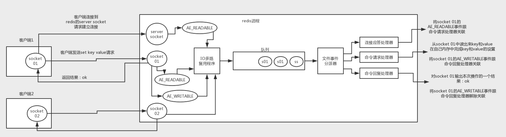
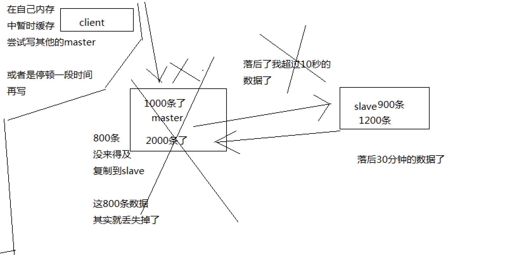
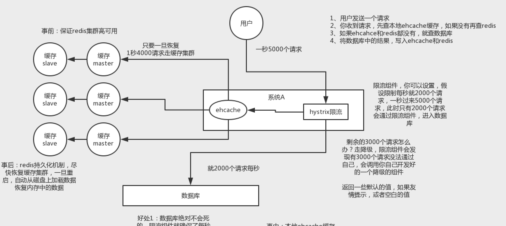
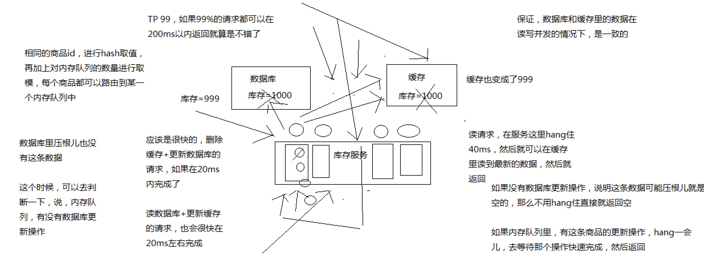

# 分布式缓存

#### 缓存有哪些缺点
* 1）缓存与数据库双写不一致
* 2）缓存雪崩
* 3）缓存穿透
* 4）缓存并发竞争

#### Redis单线程模型

* 在redis启动初始化的时候，redis会将连接应答处理器跟AE_READABLE事件关联起来，接着如果一个客户端跟redis发起连接，此时会产生一个AE_READABLE事件，然后由连接应答处理器来处理跟客户端建立连接，创建客户端对应的socket，同时将这个socket的AE_READABLE事件跟命令请求处理器关联起来。
* 当客户端向redis发起请求的时候（不管是读请求还是写请求，都一样），首先就会在socket产生一个AE_READABLE事件，然后由对应的命令请求处理器来处理。这个命令请求处理器就会从socket中读取请求相关数据，然后进行执行和处理。
* 接着redis这边准备好了给客户端的响应数据之后，就会将socket的AE_WRITABLE事件跟命令回复处理器关联起来，当客户端这边准备好读取响应数据时，就会在socket上产生一个AE_WRITABLE事件，会由对应的命令回复处理器来处理，就是将准备好的响应数据写入socket，供客户端来读取。
* 命令回复处理器写完之后，就会删除这个socket的AE_WRITABLE事件和命令回复处理器的关联关系。

#### Redis过期策略
* 定期删除 + 惰性删除
* 在你获取某个key的时候，redis会检查一下 ，这个key如果设置了过期时间那么是否过期了？如果过期了此时就会删除，不会给你返回任何东西。并不是key到时间就被删除掉，而是你查询这个key的时候，redis再懒惰的检查一下
* 数据明明都过期了，怎么还占用着内存啊？
* 你的过期key，靠定期删除没有被删除掉，还停留在内存里，占用着你的内存呢，除非你的系统去查一下那个key，才会被redis给删除掉

##### 内存淘汰机制
* 1）noeviction：当内存不足以容纳新写入数据时，新写入操作会报错，这个一般没人用吧，实在是太恶心了
* 2）allkeys-lru：当内存不足以容纳新写入数据时，在键空间中，移除最近最少使用的key（这个是最常用的）
* 3）allkeys-random：当内存不足以容纳新写入数据时，在键空间中，随机移除某个key，这个一般没人用吧，为啥要随机，肯定是把最近最少使用的key给干掉啊
* 4）volatile-lru：当内存不足以容纳新写入数据时，在设置了过期时间的键空间中，移除最近最少使用的key（这个一般不太合适）
* 5）volatile-random：当内存不足以容纳新写入数据时，在设置了过期时间的键空间中，随机移除某个key
* 6）volatile-ttl：当内存不足以容纳新写入数据时，在设置了过期时间的键空间中，有更早过期时间的key优先移除

#### 高并发和高可用

##### redis replication的核心机制
* （1）redis采用异步方式复制数据到slave节点，不过redis 2.8开始，slave node会周期性地确认自己每次复制的数据量
* （2）一个master node是可以配置多个slave node的
* （3）slave node也可以连接其他的slave node
* （4）slave node做复制的时候，是不会block master node的正常工作的
* （5）slave node在做复制的时候，也不会block对自己的查询操作，它会用旧的数据集来提供服务; 但是复制完成的时候，需要删除旧数据集，加载新数据集，这个时候就会暂停对外服务了
* （6）slave node主要用来进行横向扩容，做读写分离，扩容的slave node可以提高读的吞吐量

##### 过期key
* slave不会过期key，只会等待master过期key。如果master过期了一个key，或者通过LRU淘汰了一个key，那么会模拟一条del命令发送给slave。

##### 数据同步的核心机制
* 指的就是第一次slave连接msater的时候，执行的全量复制，那个过程里面你的一些细节的机制
* （1）master和slave都会维护一个offset
* master会在自身不断累加offset，slave也会在自身不断累加offset
* slave每秒都会上报自己的offset给master，同时master也会保存每个slave的offset
* 这个倒不是说特定就用在全量复制的，主要是master和slave都要知道各自的数据的offset，才能知道互相之间的数据不一致的情况
* （2）backlog
* master node有一个backlog，默认是1MB大小
* master node给slave node复制数据时，也会将数据在backlog中同步写一份
* backlog主要是用来做全量复制中断候的增量复制的
* （3）master run id
* info server，可以看到master run id
* 如果根据host+ip定位master node，是不靠谱的，如果master node重启或者数据出现了变化，那么slave node应该根据不同的run id区分，run id不同就做全量复制
* 如果需要不更改run id重启redis，可以使用redis-cli debug reload命令
* （4）psync
* 从节点使用psync从master node进行复制，psync runid offset
* master node会根据自身的情况返回响应信息，可能是FULLRESYNC runid offset触发全量复制，可能是CONTINUE触发增量复制

#### 全量复制
* client-output-buffer-limit 持续超过64MB 一下子超过256MB

#### redis哨兵数据丢失

##### 解决异步复制和脑裂导致的数据丢失
* min-slaves-to-write 1
* min-slaves-max-lag 10
* 一般来说，会在 client 做降级，写到本地磁盘里面，在 client 对外接收请求，再做降级，做限流，减请求涌入的速度。
* client 可能会采取将数据临时灌入个 kafka 消息队列，每隔 10 分钟去队列里面取一次，尝试重新发回 master
* 

#### cluster&&sentinal
* 数据量很少，主要承载高并发高性能，几个G单机足以
* replication，一个mater，多个slave，要几个slave跟你的要求的读吞吐量有关系，然后自己搭建一个sentinal集群，去保证redis主从架构的高可用性，就可以了
* redis cluster，主要是针对海量数据+高并发+高可用的场景，海量数据，如果你的数据量很大，那么建议就用redis cluster

#### 高可用与主备切换
1、判断节点宕机
如果一个节点认为另外一个节点宕机，那么就是pfail，主观宕机
如果多个节点都认为另外一个节点宕机了，那么就是fail，客观宕机，跟哨兵的原理几乎一样，sdown，odown
在cluster-node-timeout内，某个节点一直没有返回pong，那么就被认为pfail
如果一个节点认为某个节点pfail了，那么会在gossip ping消息中，ping给其他节点，如果超过半数的节点都认为pfail了，那么就会变成fail
2、从节点过滤
对宕机的master node，从其所有的slave node中，选择一个切换成master node
检查每个slave node与master node断开连接的时间，如果超过了cluster-node-timeout * cluster-slave-validity-factor，那么就没有资格切换成master

#### 缓存雪崩和缓存穿透
* 事前：redis高可用，主从+哨兵，redis cluster，避免全盘崩溃
* 事中：本地ehcache缓存 + hystrix限流&降级，避免MySQL被打死
* 事后：redis持久化，快速恢复缓存数据

* 缓存穿透
* ehcache

#### 缓存加数据库读写
* Cache Aside Pattern
* 每次数据过来，就只是删除缓存，然后修改数据库，如果这个缓存，在1分钟内只是被访问了1次，那么只有那1次，缓存是要被重新计算的，用缓存才去算缓存
* 其实删除缓存，而不是更新缓存，就是一个lazy计算的思想，不要每次都重新做复杂的计算，不管它会不会用到，而是让它到需要被使用的时候再重新计算

##### 缓存双写终极解决方案
* 先删除缓存，再修改数据库，如果删除缓存成功了，如果修改数据库失败了，那么数据库中是旧数据，缓存中是空的，那么数据不会不一致因为读的时候缓存没有，则读数据库中旧数据，然后更新到缓存中
* 数据库与缓存更新与读取操作进行异步串行化
* 相同的商品 id，进行 hash 取值，再加上对内存队列的数量进行取模，每个商品都可以路由到某一个内存队列中
* 
* 多个读操作可以hang住，不用压入内存队列
* 200ms内读不到，直接读数据库就返回

##### nginx机器级别的路由
* 对同一个商品的读写请求，全部路由到同一台机器
* 基于nginx和hash路由的功能

##### 热点商品的路由问题
* 热点商品的路由问题，导致请求的倾斜
* 万一某个商品的读写请求特别高，全部打到相同的机器的相同的队列里面去了，可能造成某台机器的压力过大
* 就是说，因为只有在商品数据更新的时候才会清空缓存，然后才会导致读写并发，所以更新频率不是太高的话，这个问题的影响并不是特别大
* 但是的确可能某些机器的负载会高一些

#### 线上Redis部署
* redis cluster，10台机器，5台机器部署了redis主实例，另外5台机器部署了redis的从实例，每个主实例挂了一个从实例，5个节点对外提供读写服务，每个节点的读写高峰qps可能可以达到每秒5万，5台机器最多是25万读写请求/s。
* 机器是什么配置？32G内存+8核CPU+1T磁盘，但是分配给redis进程的是10g内存，一般线上生产环境，redis的内存尽量不要超过10g，超过10g可能会有问题。
* 5台机器对外提供读写，一共有50g内存。
* 因为每个主实例都挂了一个从实例，所以是高可用的，任何一个主实例宕机，都会自动故障迁移，redis从实例会自动变成主实例继续提供读写服务
* 你往内存里写的是什么数据？每条数据的大小是多少？商品数据，每条数据是10kb。100条数据是1mb，10万条数据是1g。常驻内存的是200万条商品数据，占用内存是20g，仅仅不到总内存的50%。
* 目前高峰期每秒就是3500左右的请求量