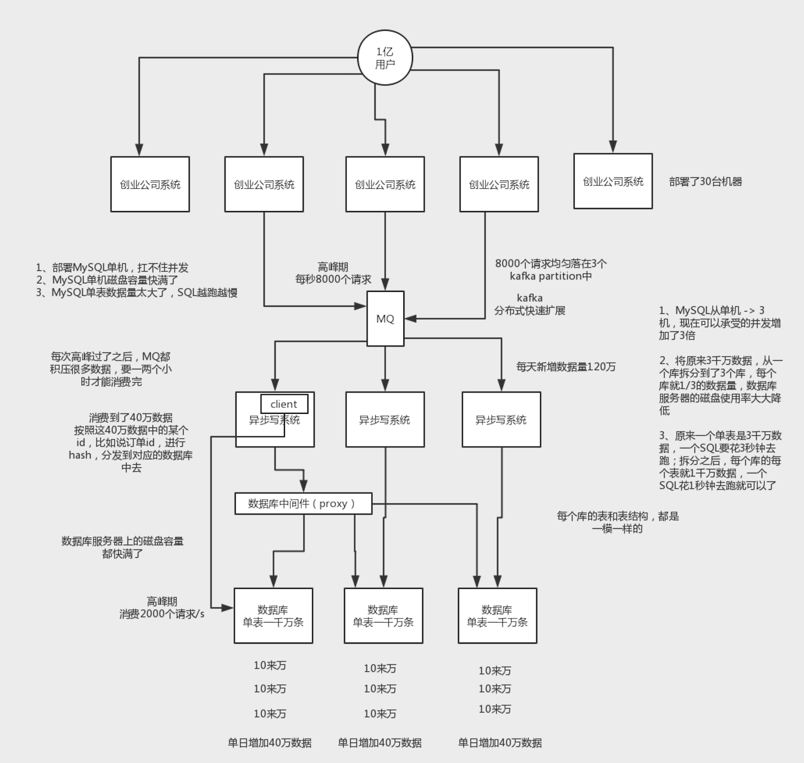
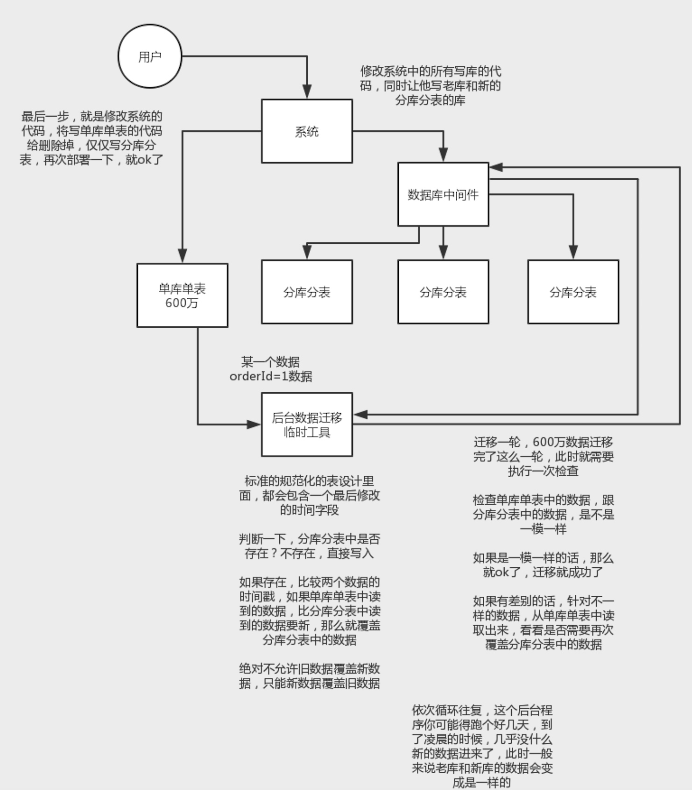
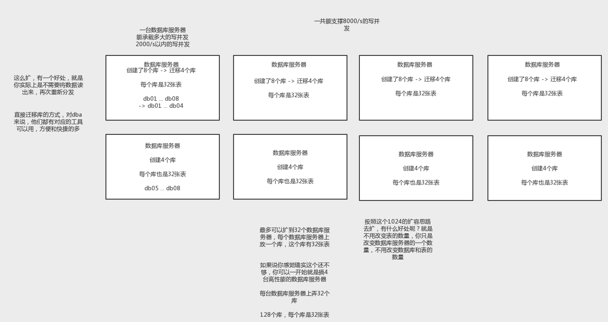
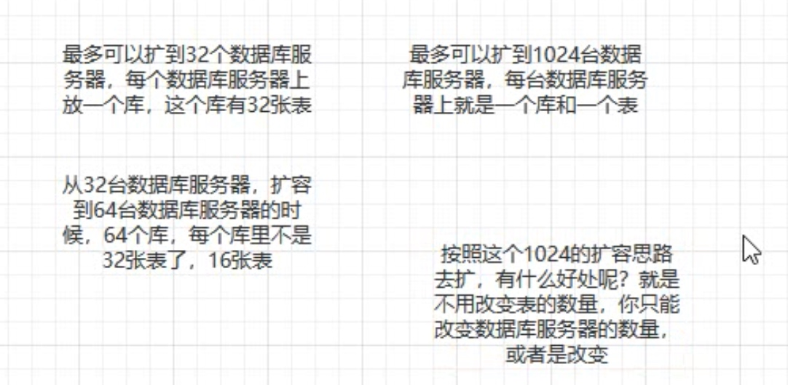
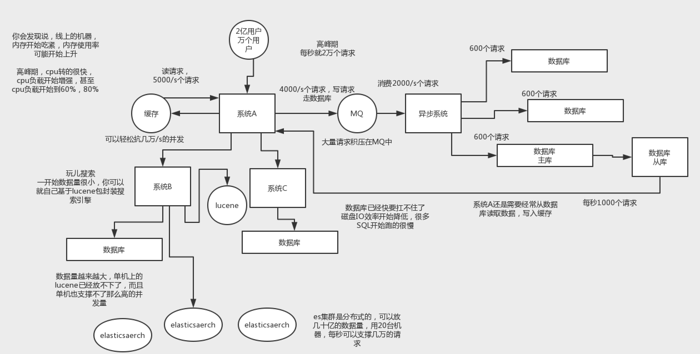

# 分库分表

#### 为什么要分库分表（设计高并发系统的时候，数据库层面该如何设计）？
* 分表是啥意思？就是把一个表的数据放到多个表中，然后查询的时候你就查一个表。比如按照用户id来分表，将一个用户的数据就放在一个表中。然后操作的时候你对一个用户就操作那个表就好了。这样可以控制每个表的数据量在可控的范围内，比如每个表就固定在200万以内
* 就是你一个库一般我们经验而言，最多支撑到并发2000，一定要扩容了，而且一个健康的单库并发值你最好保持在每秒1000左右，不要太大。那么你可以将一个库的数据拆分到多个库中，访问的时候就访问一个库好了



#### 用过哪些分库分表中间件？不同的分库分表中间件都有什么优点和缺点？

#### 你们具体是如何对数据库如何进行垂直拆分或水平拆分的？
* 垂直拆分的意思，就是把一个有很多字段的表给拆分成多个表，或者是多个库上去。每个库表的结构都不一样，每个库表都包含部分字段。一般来说，会将较少的访问频率很高的字段放到一个表里去，然后将较多的访问频率很低的字段放到另外一个表里去。因为数据库是有缓存的，你访问频率高的行字段越少，就可以在缓存里缓存更多的行，性能就越好。这个一般在表层面做的较多一些。
* 水平拆分的意思，就是把一个表的数据给弄到多个库的多个表里去，但是每个库的表结构都一样，只不过每个库表放的数据是不同的，所有库表的数据加起来就是全部数据。水平拆分的意义，就是将数据均匀放更多的库里，然后用多个库来抗更高的并发，还有就是用多个库的存储容量来进行扩容。
* 垂直拆分，你可以在表层面来做，对一些字段特别多的表做一下拆分；水平拆分，你可以说是并发承载不了，或者是数据量太大，容量承载不了

##### range&hash
* hash分法，好处在于说，可以平均分配没给库的数据量和请求压力；坏处在于说扩容起来比较麻烦，会有一个数据迁移的这么一个过程

#### 现在有一个未分库分表的系统，未来要分库分表，如何设计才可以让系统从未分库分表动态切换到分库分表上？



#### 如何设计可以动态扩容缩容的分库分表方案？
* 选择一个数据库中间件，调研、学习、测试
* 设计你的分库分表的一个方案，你要分成多少个库，每个库分成多少个表，3个库每个库4个表
* 基于选择好的数据库中间件，以及在测试环境建立好的分库分表的环境，然后测试一下能否正常进行分库分表的读写
* 完成单库单表到分库分表的迁移，双写方案
* 线上系统开始基于分库分表对外提供服务
* 扩容了，扩容成6个库，每个库需要12个表，你怎么来增加更多库和表呢？
* 一开始上来就是32个库，每个库32个表，一共1024张表
* 每个库正常承载的写入并发量是1000，那么32个库就可以承载32 * 1000 = 32000的写并发，如果每个库承载1500的写并发，32 * 1500 = 48000的写并发，接近5万/s的写入并发，前面再加一个MQ，削峰，每秒写入MQ 8万条数据，每秒消费5万条数据。
* 
* 
* id / 32 取库，id /32 取表
* 设定好几台数据库服务器，每台服务器上几个库，每个库多少个表，推荐是32库 * 32表，对于大部分公司来说，可能几年都够了

* 路由的规则，orderId 模 32 = 库，orderId / 32 模 32 = 表
* 扩容的时候，申请增加更多的数据库服务器，装好mysql，倍数扩容，4台服务器，扩到8台服务器，16台服务器
* 由dba负责将原先数据库服务器的库，迁移到新的数据库服务器上去，很多工具，库迁移，比较便捷
* 我们这边就是修改一下配置，调整迁移的库所在数据库服务器的地址
* 重新发布系统，上线，原先的路由规则变都不用变，直接可以基于2倍的数据库服务器的资源，继续进行线上系统的提供服务

##### 分库分表之后，id主键如何处理？
* snowflake算法

```
0 | 0001100 10100010 10111110 10001001 01011100 00 | 10001 | 1 1001 | 0000 00000000
```

#### 读写分离
* 拆分主库
* 打开并行复制，多个库并行复制，单库并发很高，并行复制没有意义

#### 设计高并发的系统架构

* 