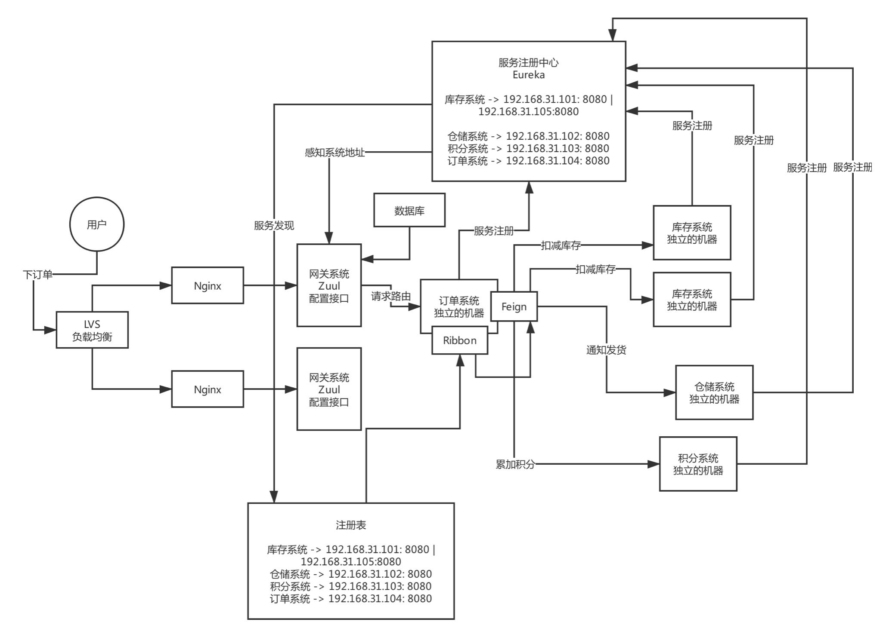
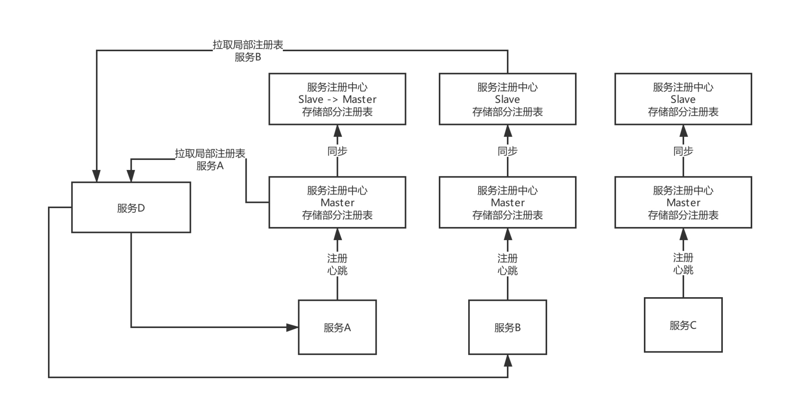

# 注册中心

#### 发现原理
* 服务发现的时效性
* 一致性 可用性
* 容量

#### 网关
* 高并发

##### (1)动态路由：新开发某个服务，动态把请求路径和服务的映射关系热加载到网关里去；服务增减机器，网关自动热感知

##### (2)灰度发布：基于现成的开源插件来做

##### (3)授权认证

##### (4)限流熔断

##### (5)性能监控：每个API接口的耗时、成功率、QPS

##### (6)系统日志

##### (7)数据缓存

#### 部署上万服务实例，服务注册中心是否扛住
* 

#### 灰度发布
* 生产环境，微服务生产实践
* 开发了一个新的服务，线上部署，配合网关动态路由的功能，在网关里配置一下路径和新服务的映射关系，此时请求过来直接就可以走到新的服务里去
* 对已有服务进行迭代和开发，新版本，灰度发布，新版本部署少数几台机器，通过一个界面，开启这个服务的灰度发布，此时zuul filter启用，按照你的规则，把少量的流量打入到新版本部署的机器上去
* 观察一下少量流量在新版本的机器上运行是否正常
* 版本改成current，全量机器部署，关闭灰度发布功能，网关就会把流量均匀分发给那个服务了

#### QPS
* 计算一下每个接口从请求到执行完毕，需要耗费多长时间，算一下每个接口平均的请求延时，TP99，TP95，TP90，TP50，TP99，99%的请求耗费的时间在100ms以内，但是1%的请求可能耗费的时间在100ms以上
TP99 = 100ms TP95 = 50ms，95%的请求耗费的时间多在50ms以内，但是5%的请求耗费的时间在50ms以上

#### 系统扩容
* 网关直接多部署10倍的机器即可，前面的Nginx做会负载均衡，把流量均匀分发给各个网关机器
* 服务扩容，都很简单的，多加机器，部署启动，自动注册到注册中心里去，此时其他服务会自动感知到你的服务多加了一些机器
* 服务实例变多了10倍，此时几十个服务实例，几百个服务实例，对eureka机器会造成每秒几百请求，没问题，eureka机器，8核16G的配置，单机抗上千请求，很轻松
* 数据库本来是每秒几百请求，10倍，每秒高峰期是三四千请求，横向扩容很麻烦，此时可以考虑给单个数据库部署的机器提高配置，32核128G高配物理机，每秒钟抗几千请求问题不大
* 
