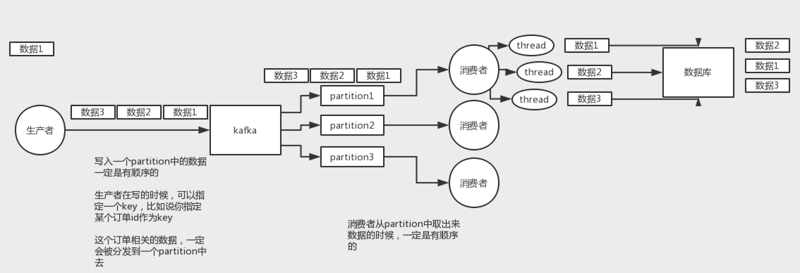
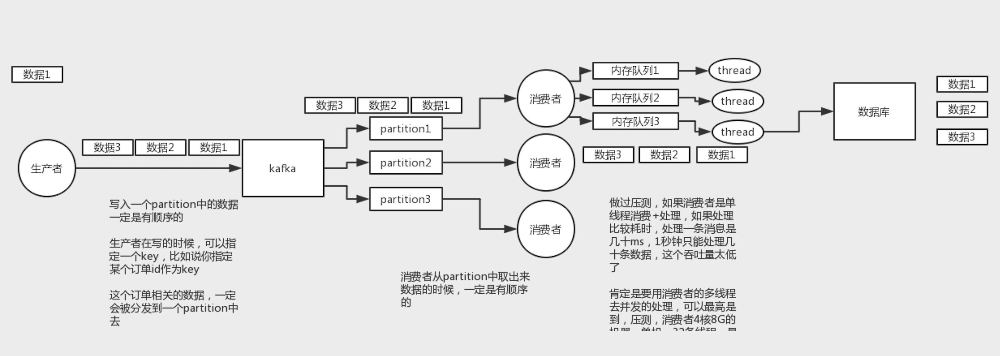
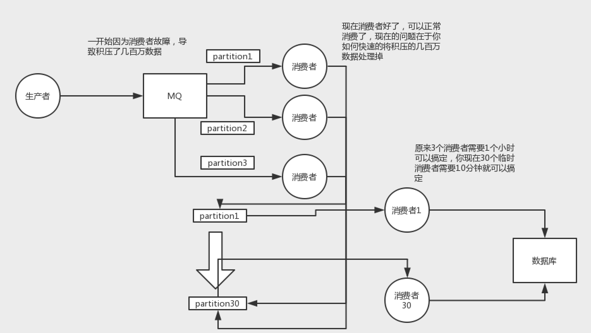

# 消息队列
#### 技术选型
* 削峰
* 解耦
* 异步

#### 消息幂等性
* 根据数据库唯一键来进行去重

#### 消息队列消息乱序

* 消费者通过id hash到一个内存队列，每个线程消费一个队列
* 肯定是要用消斐者的多线程去并发的处理，可以最高是到，压测，消费者 4 核 8 G 的机器，单机，32 条线程，最高每秒可以处理上千条消息

#### 保证消息可靠性
* 生产者开启异步confirm机制
* broker持久化磁盘
* queque设置为持久化
* deliveryMode设置为持久化
* 消费端开启ack机制

#### 消费者大幅度加压
* 1）先修复consumer的问题，确保其恢复消费速度，然后将现有cnosumer都停掉
* 2）新建一个topic，partition是原来的10倍，临时建立好原先10倍或者20倍的queue数量
* 3）然后写一个临时的分发数据的consumer程序，这个程序部署上去消费积压的数据，消费之后不做耗时的处理，直接均匀轮询写入临时建立好的10倍数量的queue
* 4）接着临时征用10倍的机器来部署consumer，每一批consumer消费一个临时queue的数据
* 如果rabbitmq的订单丢了，只能手动写程序查出来，手动发到mq再补一次

#### 怎么设计消息队列
* 首先这个mq得支持可伸缩性吧，就是需要的时候快速扩容，就可以增加吞吐量和容量，那怎么搞？设计个分布式的系统呗，参照一下kafka的设计理念，broker -> topic -> partition，每个partition放一个机器，就存一部分数据。如果现在资源不够了，简单啊，给topic增加partition，然后做数据迁移，增加机器，不就可以存放更多数据，提供更高的吞吐量了？

* 其次你得考虑一下这个mq的数据要不要落地磁盘吧？那肯定要了，落磁盘，才能保证别进程挂了数据就丢了。那落磁盘的时候怎么落啊？顺序写，这样就没有磁盘随机读写的寻址开销，磁盘顺序读写的性能是很高的，这就是kafka的思路。

* 其次你考虑一下你的mq的可用性啊？这个事儿，具体参考我们之前可用性那个环节讲解的kafka的高可用保障机制。多副本 -> leader & follower -> broker挂了重新选举leader即可对外服务。

* 能不能支持数据0丢失啊？可以的，参考我们之前说的那个kafka数据零丢失方案
