# 高可用架构
* 在各种系统的各个地方有乱七八糟的异常和故障的情况下，整套缓存系统还能继续健康的run着
* 资源隔离、限流、熔断、降级、运维监控

#### 资源隔离
* 资源隔离：让你的系统里，某一块东西，在故障的情况下，不会耗尽系统所有的资源，比如线程资源、
* 我实际的项目中的一个case，有一块东西，是要用多线程做一些事情，小伙伴做项目的时候，没有太留神，资源隔离，那块代码，在遇到一些故障的情况下，每个线程在跑的时候，因为那个bug，直接就死循环了，导致那块东西启动了大量的线程，每个线程都死循环

#### 依赖性
* eshop-cache，在各级缓存数据都失效的情况下，会重新从源系统中调用接口，依赖源系统去查询mysql数据库去重新获取数据
* 如果你的各种依赖的服务有了故障，那么很可能会导致你的系统不可用
* hystrix对系统进行各种高可用性的系统加固，来应对各种不可用的情况

#### hystrix设计原则
（1）阻止任何一个依赖服务耗尽所有的资源，比如tomcat中的所有线程资源
（2）避免请求排队和积压，采用限流和fail fast来控制故障
（3）提供fallback降级机制来应对故障
（4）使用资源隔离技术，比如bulkhead（舱壁隔离技术），swimlane（泳道技术），circuit breaker（短路技术），来限制任何一个依赖服务的故障的影响
（5）通过近实时的统计/监控/报警功能，来提高故障发现的速度
（6）通过近实时的属性和配置热修改功能，来提高故障处理和恢复的速度
（7）保护依赖服务调用的所有故障情况，而不仅仅只是网络故障情况

#### 电商服务
* 分布式系统：商品详情页，缓存服务，+底层源数据服务，商品信息服务，店铺信息服务，广告信息服务，推荐信息服务，综合起来组成一个分布式的系统
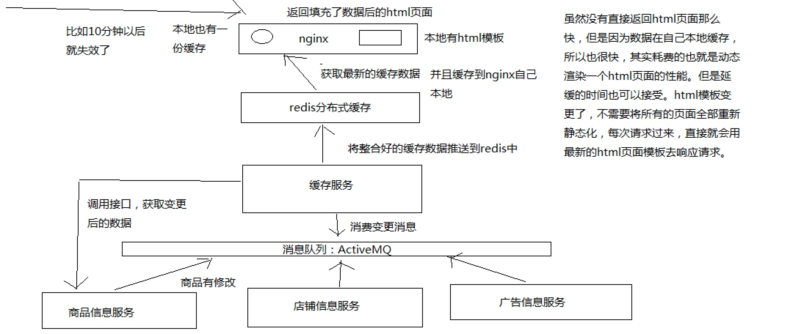

##### 商品服务接口导致缓存服务资源耗尽的情况
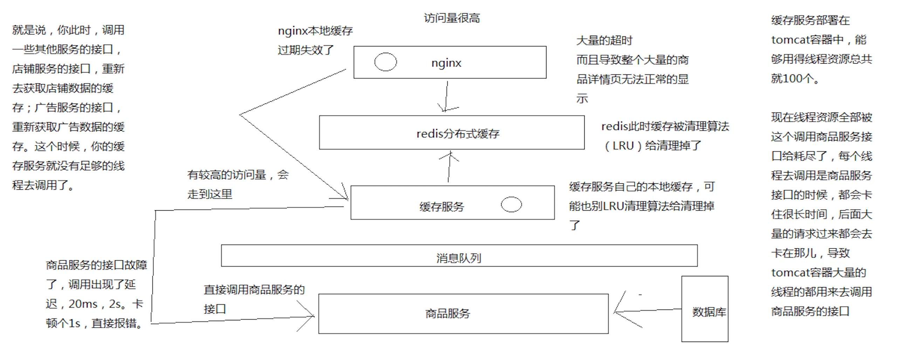
* HystrixCommand：是用来获取一条数据的
* HystrixObservableCommand：是设计用来获取多条数据的
* 同步：new CommandHelloWorld("World").execute()，new ObservableCommandHelloWorld("World").toBlocking().toFuture().get()
* 如果你认为observable command只会返回一条数据，那么可以调用上面的模式，去同步执行，返回一条数据
* 异步：new CommandHelloWorld("World").queue()，new ObservableCommandHelloWorld("World").toBlocking().toFuture()
* 对command调用queue()，仅仅将command放入线程池的一个等待队列，就立即返回，拿到一个Future对象，后面可以做一些其他的事情，然后过一段时间对future调用get()方法获取数据

#### 隔离技术
* hystrix里面，核心的一项功能，其实就是所谓的资源隔离，要解决的最最核心的问题，就是将多个依赖服务的调用分别隔离到各自自己的资源池内
* 避免说对某一个依赖服务的调用，因为依赖服务的接口调用的延迟或者失败，导致服务所有的线程资源全部耗费在这个服务的接口调用上
* 一旦说某个服务的线程资源全部耗尽的话，可能就导致服务就会崩溃，甚至说这种故障会不断蔓延
* hystrix，资源隔离，两种技术，线程池的资源隔离，信号量的资源隔离

##### 线程池隔离技术
* 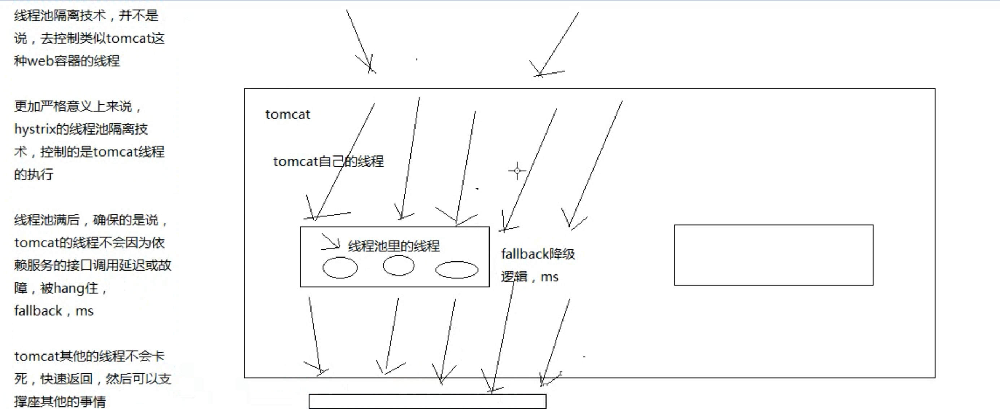

##### 信号量隔离技术
* 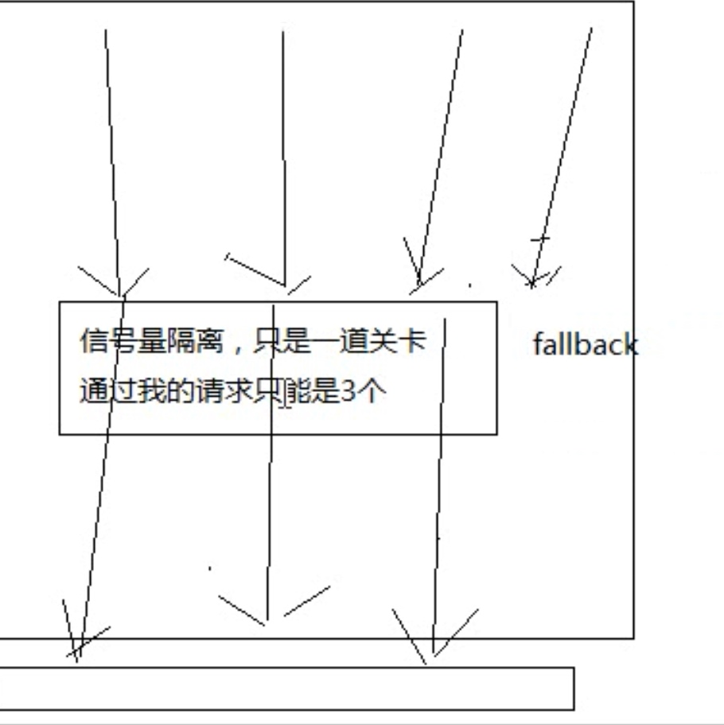
* 限流的作用

##### 线程池和信号量隔离技术区别
* 线程池和信号量做资源隔离，限流，容量的限制，默认的容量都是 10。区别，核心的区別，线程池隔离技术，是用自己的线程去执行调用的；信号量的技木，是直接让 tomcat 的线程去调用依赖服务的
* 线程池可以让hystrix控制超时

##### 适用场景
* 线程池：适合绝大多数的场景，99%的，线程池，对依赖服务的网络请求的调用和访问，timeout这种问题
* 信号量：适合，你的访问不是对外部依赖的访问，而是对内部的一些比较复杂的业务逻辑的访问，但是像这种访问，系统内部的代码，其实不涉及任何的网络请求，那么只要做信号量的普通限流就可以了，因为不需要去捕获timeout类似的问题，算法+数据结构的效率不是太高，并发量突然太高，因为这里稍微耗时一些，导致很多线程卡在这里的话，不太好，所以进行一个基本的资源隔离和访问，避免内部复杂的低效率的代码，导致大量的线程被hang住

##### 信号量场景
* 在代码中加入从本地内存获取地理位置数据的逻辑
* 业务背景里面， 比较适合信号量的是什么场景呢？
* 比如说，我们一般来说，缓存服务，可能会将部分量特别少，访问又特别频繁的一些数据，放在自己的纯内存中
* 一般我们在获取到商品数据之后，都要去获取商品是属于哪个地理位置，省，市，卖家的，可能在自己的纯内存中，比如就一个Map去获取
* 对于这种直接访问本地内存的逻辑，比较适合用信号量做一下简单的隔离

##### 代码
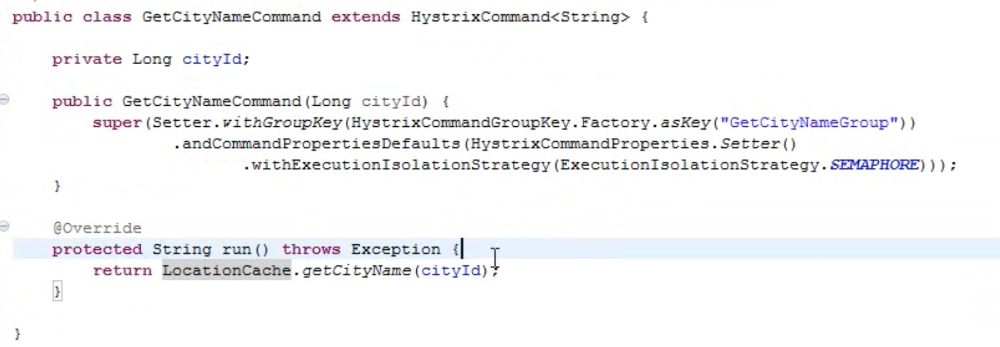
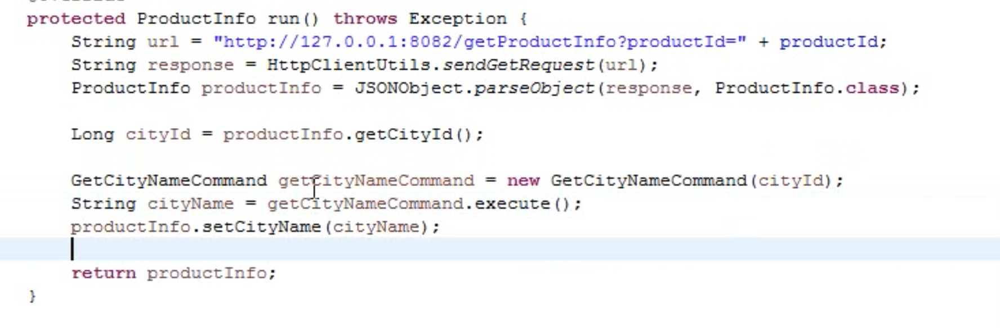

#### 隔离策略
* execution.isolation.strategy THREAD,SEMAPHORE

#### 线程池隔离，依赖服务->接口->线程池，如何来划分
* 每个command，都可以设置一个自己的名称，同时可以设置一个自己的组
* command group，是一个非常重要的概念，默认情况下，因为就是通过command,group来定义一个线程池的，而且还会通过command group来聚合一些监控和报警信息同一个command group中的请求，都会进入同一个线程池中
* command threadpool -> command group -> command key
* command key，代表了一类command，一般来说，代表了底层的依赖服务的一个接口
* command group，代表了某一个底层的依赖服务，合理，一个依赖服务可能会暴露出来多个接口，每个接口就是一个command key
* command group，在逻辑上去组织起来一堆command key的调用，统计信息，成功次数，timeout超时次数，失败次数，可以看到某一个服务整体的一些访问情况
* command group，一般来说，推荐是根据一个服务去划分出一个线程池，command key默认都是属于同一个线程池的

##### 细粒度划分
* 举个例子，对于一个服务中的某个功能模块来说，希望将这个功能模块内的所有command放在一个group中，那么在监控和报警的时候可以放一起看
* command group，对应了一个服务，但是这个服务暴露出来的几个接口，访问量很不一样，差异非常之大
* 你可能就希望在这个服务command group内部，包含的对应多个接口的command key，做一些细粒度的资源隔离
* 对同一个服务的不同接口，都使用不同的线程池
* command key -> command group
* command key -> 自己的threadpool key
* 逻辑上来说，多个command key属于一个command group，在做统计的时候，会放在一起统计
* 每个command key有自己的线程池，每个接口有自己的线程池，去做资源隔离和限流
* 但是对于thread pool资源隔离来说，可能是希望能够拆分的更加一致一些，比如在一个功能模块内，对不同的请求可以使用不同的thread pool
* command group一般来说，可以是对应一个服务，多个command key对应这个服务的多个接口，多个接口的调用共享同一个线程池

##### 参数
* coresize 线程池大小
* 线程池加queue原理
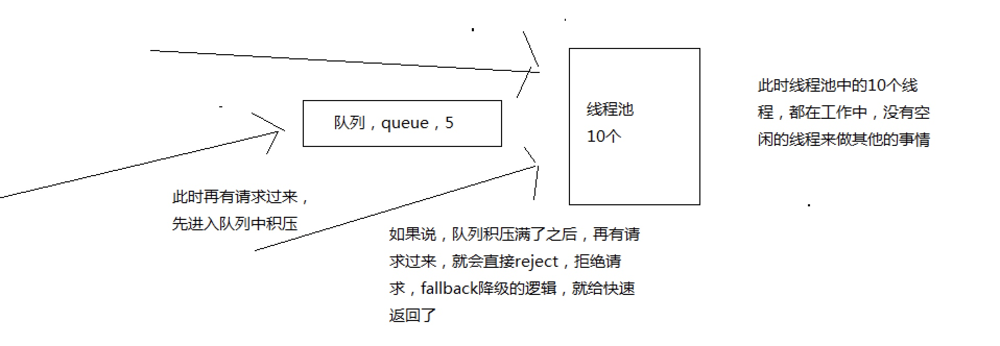

#### 短路器
*  circuit breaker

#### 执行流程
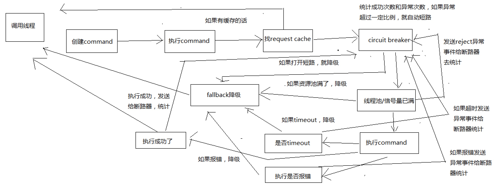
* 构建一个HystrixCommand或者HystrixObservableCommand
* 调用command的执行方法 execute()，queue()，observe()，toObservable()
* 如果这个command开启了请求缓存，request cache，而且这个调用的结果在缓存中存在，那么直接从缓存中返回结果
* 检查线程池/队列/semaphore是否已经满了
* 执行command
* 短路健康检查
* 调用fallback降级机制

#### fallback
* 报错了，访问mysql报错，redis报错，zookeeper报错，kafka报错，error
* 对每个外部依赖，无论是服务接口，中间件，资源隔离，对外部依赖只能用一定量的资源去访问，线程池/信号量，如果资源池已满，reject
* 访问外部依赖的时候，访问时间过长，可能就会导致超时，报一个TimeoutException异常，timeout
* 异常事件的占比达到一定的比例，直接开启短路， circuit breaker

#### 降级机制
* 内存中维护一个ehcache，作为一个纯内存的基于LRU自动清理的缓存，数据也可以放入缓存内
* 外部依赖有异常，fallback这里，直接尝试从ehcache中获取数据
* 纯内存数据，默认值
* 降级参数fallback.isolation.semaphore.maxConcurrentRequests这个参数设置了HystrixCommand.getFallback()最大允许的并发请求数量，默认值是10，也是通过semaphore信号量的机制去限流，如果超出了这个最大值，那么直接被reject
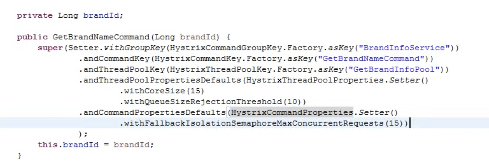

#### 短路器原理
* 如果经过短路器的流量超过了一定的阈值，
* 如果断路器统计到的异常调用的占比超过了一定的阈值，
* 短路器流量 执行一个command，这个请求就一定会经过短路器
* 然后断路器从close状态转换到open状态
* 断路器打开的时候，所有经过该断路器的请求全部被短路，不调用后端服务，直接走fallback降级
* 经过了一段时间之后HystrixCommandProperties.circuitBreakerSleepWindowInMilliseconds()，会half-open，让一条请求经过短路器，看能不能正常调用。如果调用成功了，那么就自动恢复，转到close状态短路器，会自动恢复的，half-open，半开状态

##### 配置
* circuitBreaker.enabled
控制短路器是否允许工作，包括跟踪依赖服务调用的健康状况，以及对异常情况过多时是否允许触发短路，默认是true
* circuitBreaker.requestVolumeThreshold
设置一个rolling window，滑动窗口中，最少要有多少个请求时，才触发开启短路
* circuitBreaker.errorThresholdPercentage
设置异常请求量的百分比，当异常请求达到这个百分比时，就触发打开短路器，默认是50，也就是50%
* circuitBreaker.sleepWindowInMilliseconds
设置在短路之后，需要在多长时间内直接reject请求，然后在这段时间之后，再重新导holf-open状态，尝试允许请求通过以及自动恢复，默认值是5000毫秒
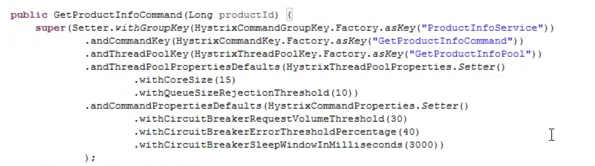

#### 线程池隔离技术的设计原则
* Hystrix采取了bulkhead舱壁隔离技术，来将外部依赖进行资源隔离，进而避免任何外部依赖的故障导致本服务崩溃
* 线程池隔离，学术名称：bulkhead，舱壁隔离
* 外部依赖的调用在单独的线程中执行，这样就能跟调用线程隔离开来，避免外部依赖调用timeout耗时过长，导致调用线程被卡死
* Hystrix对每个外部依赖用一个单独的线程池，这样的话，如果对那个外部依赖调用延迟很严重，最多就是耗尽那个依赖自己的线程池而已，不会影响其他的依赖调用

#### 线程池隔离技术的优点
* （1）任何一个依赖服务都可以被隔离在自己的线程池内，即使自己的线程池资源填满了，也不会影响任何其他的服务调用
* （2）服务可以随时引入一个新的依赖服务，因为即使这个新的依赖服务有问题，也不会影响其他任何服务的调用
* （3）当一个故障的依赖服务重新变好的时候，可以通过清理掉线程池，瞬间恢复该服务的调用，而如果是tomcat线程池被占满，再恢复就很麻烦
* （4）如果一个client调用库配置有问题，线程池的健康状况随时会报告，比如成功/失败/拒绝/超时的次数统计，然后可以近实时热修改依赖服务的调用配置，而不用停机
* （5）如果一个服务本身发生了修改，需要重新调整配置，此时线程池的健康状况也可以随时发现，比如成功/失败/拒绝/超时的次数统计，然后可以近实时热修改依赖服务的调用配置，而不用停机
* （6）基于线程池的异步本质，可以在同步的调用之上，构建一层异步调用层
* 简单来说，最大的好处，就是资源隔离，确保说，任何一个依赖服务故障，不会拖垮当前的这个服务

#### 线程池隔离技术的优点
* （1）线程池机制最大的缺点就是增加了cpu的开销
* 除了tomcat本身的调用线程之外，还有hystrix自己管理的线程池
* （2）每个command的执行都依托一个独立的线程，会进行排队，调度，还有上下文切换
* （3）Hystrix官方自己做了一个多线程异步带来的额外开销，通过对比多线程异步调用+同步调用得出，Netflix API每天通过hystrix执行10亿次调用，每个服务实例有40个以上的线程池，每个线程池有10个左右的线程
* （4）最后发现说，用hystrix的额外开销，就是给请求带来了3ms左右的延时，最多延时在10ms以内，相比于可用性和稳定性的提升，这是可以接受的

#### hystrix semaphore
* hystrix semaphore技术来实现对某个依赖服务的并发访问量的限制，而不是通过线程池/队列的大小来限制流量
* sempahore技术可以用来限流和削峰，但是不能用来对调研延迟的服务进行timeout和隔离
* execution.isolation.strategy，设置为SEMAPHORE，那么hystrix就会用semaphore机制来替代线程池机制，来对依赖服务的访问进行限流
* 如果通过semaphore调用的时候，底层的网络调用延迟很严重，那么是无法timeout的，只能一直block住
* 一旦请求数量超过了semephore限定的数量之后，就会立即开启限流
* 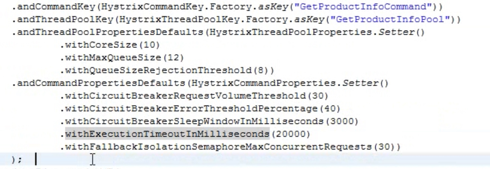
* withCoreSize：设置你的线程池的大小
* withMaxQueueSize：设置的是你的等待队列，缓冲队列的大小
* withQueueSizeRejectionThreshold：如果withMaxQueueSize<withQueueSizeRejectionThreshold，那么取的是withMaxQueueSize，反之，取得是withQueueSizeRejectionThreshold
* withExecutionTimeoutInMilliseconds
* withFallbackIsolationSemaphoreMaxConcurrentRequests

#### timeout
* withExecutionTimeoutInMilliseconds
* withFallbackIsolationSemaphoreMaxConcurrentRequests

#### hystrix的高阶知识
* 